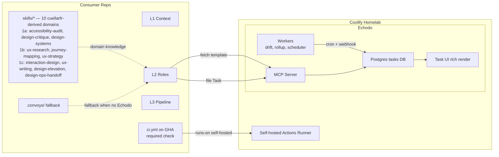

# Pipeline v0.4 — Design Domains + Echodo Integration

Drafted: 2026-06-02. Status: **DRAFT**. Locks the scope for `agent-pipeline` v0.4. Spec follows the format of `[docs/orchestration-spec.md](docs/orchestration-spec.md)`.

## 1. Current state (what we have today)

### 1.1 Pipeline architecture (3 layers, validated)


| Layer             | What ships                                                                                                                                   | Stand-alone?                  | Maturity                              |
| ----------------- | -------------------------------------------------------------------------------------------------------------------------------------------- | ----------------------------- | ------------------------------------- |
| **L1 — Context**  | `AGENTS.md`, `.cursor/rules/*.mdc`, `.cursor/skills/*/SKILL.md`, optional Prisma schema map                                                  | Yes (-53% token win on colab) | Shipped                               |
| **L2 — Roles**    | 9 `.cursor/agents/role-*.md` (conductor, ia, ux-reviewer, architect, implementer, reviewer, design-system-auditor, a11y-auditor, doc-writer) | Yes                           | Shipped                               |
| **L3 — Pipeline** | CI workflows, PR template, CODEOWNERS, `.convoys/`, optional flag wrapper, weekly drift cron                                                 | Yes                           | Shipped, multi-platform variants live |


### 1.2 Skills inventory (today)

- `skills/bootstrap-agent-context/` — installs L1+L2+L3 into a target repo. ~540 lines SKILL.md + `templates/{L1-context,L2-roles,L3-pipeline}/`.
- `skills/sync-agent-context/` — drift detection + per-file update flow. Reads `.agent-context-manifest.yml`.
- No domain-knowledge skills (a11y, design critique, design systems exist only as terse inline checklists inside the L2 role files).

### 1.3 Known limitations (drives v0.4)

1. **Audit role files carry shallow knowledge** — `role-a11y-auditor.md` has ~30 lines of inline checklist; can satisfy "do an audit" but cannot produce repeatable severity, scoring, or framework-grounded recommendations. **Broader**: the pipeline has *no* domain skills for upstream design work (research, strategy, journey mapping) or output craft (interaction design, UX writing, visual elevation, design ops). Convoys rely on the model's prior knowledge for everything except the three audit roles — and even those rely on terse inline checklists.
2. **No standardized deliverable templates** — roles specify output verbally ("append a UX section with…") but no fillable template skeleton ships. Output shape varies run-to-run.
3. **Soft phrasing in role files** — phrases like "follow a11y best practices" and "closest existing pattern" need to become opinionated defaults (specific rubrics, severity 0-4 scales).
4. **No `examples/` folder in any skill** — agents have no end-to-end walkthroughs to ground variance.
5. **Audit findings rot** — they live in a chat or PR comment, never become tracked product work.
6. **GitHub Actions costs accumulate** for stateful or low-value-on-GHA workloads (cron drift checks, rollup aggregation, convoy metrics).
7. **No "ingest" pattern** for external specs/PRDs into a convoy seed.
8. **No convoy lifecycle state machine** — convoy status is implicit, encoded in file existence (`.convoys/<slug>.md`) and role hand-off messaging. No server-enforced gate transitions, no actor attribution on status changes, no queryable "what convoys are awaiting Gate 1 approval" view across repos.
9. `**tasks` repo is currently a `partial` consumer of the pipeline** (`[docs/CONSUMERS.md](docs/CONSUMERS.md)` line 41 — L1-only: 4 rules + AGENTS.md, no L2 roles, no L3). To dogfood the Echodo integration end-to-end, `tasks` itself must be a fully synced consumer.
10. **No closed quality loop on non-code artifacts.** Convoys, briefs, audit reports, research syntheses, journey maps, and other Phase 1/2 deliverables ship as soon as the producing role hands off — there is no reviewer/editor/auditor pass on the artifact itself, no retro after the convoy completes, and no mechanism for friction discovered in one consumer to flow back to the pipeline upstream. Today's `role-reviewer` only reviews **code diffs** against the brief; it doesn't audit the brief, the convoy plan, or the research synthesis that informed them. This drives §9 (v0.5+ L4 layer).

### 1.4 What we are NOT doing in v0.4

- Replacing the 3-layer architecture. Layers stay.
- Replacing Cursor as the agent substrate.
- Replacing GitHub for PRs/issues/required checks.
- Adopting cuellarfr/design-skills' CLI installer (`npx skills add ...`). Borrow all 10 domain skills and their progressive-disclosure architecture; install them through `bootstrap-agent-context` / `sync-agent-context` so the manifest tracks them like any other artifact.
- Adopting cuellarfr/design-skills' Trimble Modus baseline wholesale. Treat their `ux-writing` and `design-elevation` Modus content as a *reference* dependency, not a forced default — consumers stay on their own design language unless they opt in.
- Adopting karpathy-llm-wiki's Obsidian toolchain. Borrow only the patterns (health check, lint, log).
- Spawning new convoy classifications (`research-only`, `strategy-only`, `journey-mapping`) for the upstream-design skills in waves 1b/1c. These are flagged as v0.5+ candidates once we see how the new skills get used in practice. For v0.4, those skills are invoked manually outside the convoy flow OR informally during the Conductor's classification step.
- Building L4 — the closed quality loop (artifact reviewer/editor/auditor pass + per-convoy retro + cross-convoy self-improvement loop + upstream courier). L4 is **v0.5+ work** outlined in §9 of this plan as a forward reference. Adding it to v0.4 would make v0.4 unshippable. The only optional foothold v0.4 may carry is a placeholder `role-artifact-quality.md` stub (combined reviewer+editor+auditor) that gets fleshed out in v0.5 — and even that is opt-in, not required for v0.4 to land.

---

## 2. Target architecture (after v0.4)




Three architectural shifts:

1. **Hybrid A+C for design deliverables**: domain skills (in `agent-pipeline`) carry the *how*; Echodo task templates (in `tasks/`) carry the canonical *output shape*; L2 roles connect them via MCP and fall back to `.convoys/` when Echodo isn't available.
2. **Convoy lifecycle moves into Echodo**: the `objects` table becomes the source of truth for convoy/brief/audit state. A server-enforced state machine replaces implicit-status-by-file-convention. Human gates become explicit status transitions attributed to `human-gate-1/2/3` actors. See §7.
3. **Two-layer GitHub cost split**: GHA hosts only PR-required checks; everything stateful or scheduled moves to Echodo workers; everything else moves runtime to a self-hosted runner on Coolify.

### 2.1 Two complementary MCP families

The v0.4 MCP surface has **two intentionally separate concerns**, shipped in different sub-phases:


| Family        | Concern                                                                       | Ships in | Tool style                                           |
| ------------- | ----------------------------------------------------------------------------- | -------- | ---------------------------------------------------- |
| **Lifecycle** | "Where is this convoy in its workflow? Who moved it? Can it transition to X?" | Phase 2a | Semantic wrappers with state-machine validation      |
| **Templates** | "What shape does an a11y audit deliverable take? Create a task that matches." | Phase 2b | Generic primitives the domain skills compose against |


Both ride on Echodo's existing `objects` CRUD (`create_object`, `update_object`, `search_objects`) — they don't replace it, they add semantic and validation layers above it. The lifecycle family is **independent of domain skills** and can ship in parallel with Phase 1. The template family **depends on Phase 1** (the domain skills define the deliverable shapes the templates encode).

---

## 3. Phases

### Phase 0 — Document this plan + bootstrap the guinea pig

**Scope:** land this spec in the pipeline repo so future work has a reference, and promote `tasks` to a fully synced consumer so it can dogfood Phase 2a immediately.

**Deliverables:**

- New file `[docs/v0.4-design-domains-and-echodo.md](docs/v0.4-design-domains-and-echodo.md)` — contents of this plan.
- Update `[docs/CONSUMERS.md](docs/CONSUMERS.md)` with a forward-looking "what's coming in v0.4" section (one paragraph + link).
- Run `bootstrap-agent-context` against `tasks` to install L2 (9 role files) + L3 (CI variant — likely `nextjs-prisma-coolify`, to confirm at install time). Write `.agent-context-manifest.yml` in `tasks`.
- Move `tasks` from "Partial consumers" to "Synced consumers" in `[docs/CONSUMERS.md](docs/CONSUMERS.md)`.
- Create the `convoys-tasks` workspace in Echodo (`echodo.stillwell.cloud`) as the dogfooding target for Phase 2a.
- No `agent-pipeline` code changes; the only code touched is the L2/L3 install in `tasks`.

**Exit criteria:**

- Spec is locked, can be referenced from later PRs.
- `tasks` has `.cursor/agents/role-*.md`, an installed L3 variant, and a manifest.
- `convoys-tasks` workspace exists in Echodo and is queryable via `resolveWorkspaceHandle("convoys-tasks")`.

---

### Phase 1 — All 10 cuellarfr/design-skills (three waves, no Echodo dependency)

Adopts the full cuellarfr/design-skills catalog (10 domains, ~46,400 lines total) under the pipeline's progressive-disclosure conventions (Anthropic's ≤500-line SKILL.md target, depth pushed to `references/` per skill). All skills work standalone — no Echodo dependency in Phase 1; that's Phase 2b.

The waves are organized by sequencing constraint, not by skill quality. **1a is sequence-critical** (slims existing L2 audit roles, which has to land before the audit roles diverge further); **1b and 1c are parallel-safe** with each other and with Phase 2a.

#### Phase 1a — Audit-aligned (3 skills, sequence-critical)

These three slim three existing L2 roles 1:1.

**Scope:**

```
skills/
  accessibility-audit/             ← maps to cuellarfr "Accessibility Audit" (~2,175 lines, 8 files)
    SKILL.md                 (≤350 lines; 5-layer audit, WCAG 2.2, severity 0-4)
    references/
      wcag-2.2-checklist.md  (11 audit-task groups)
      common-issues.md       (WebAIM Million top-15, before/after code)
      tools-comparison.md    (axe / WAVE / Lighthouse / Pa11y)
      test-scripts.md        (keyboard + screen reader scripts)
    templates/
      audit-report.md        (Echodo-compatible — Phase 2b template source)
    examples/
      walkthrough.md
  design-critique/                 ← maps to cuellarfr "Design Critique & Evaluation" (~3,100 lines, 10 files)
    SKILL.md                 (≤350 lines; 9-step critique, Nielsen 10, 27 UX laws)
    references/
      heuristics-and-laws.md
      patterns-catalog.md    (50+ interaction patterns)
      visual-design.md       (hierarchy, typography, color, spacing)
      ia-evaluation.md       (4 systems, labeling, quick diagnostic)
      ux-writing-review.md
    templates/
      critique-report.md     (Phase 2b template source)
    examples/
      walkthrough.md
  design-systems/                  ← maps to cuellarfr "Design Systems" (~4,500 lines, 13 files)
    SKILL.md                 (≤350 lines; tokens, components, governance, maturity)
    references/
      token-architecture.md  (3-tier, W3C format)
      component-hierarchy.md (Atomic Design: atoms through pages)
      governance.md          (centralized / federated / hybrid)
      perceptual-patterns.md (color, type, spacing, motion, voice/tone)
      maturity-model.md
    templates/
      ds-audit-report.md     (Phase 2b template source)
    examples/
      walkthrough.md
```

**L2 role slimming (same PR per skill):**

- `[templates/L2-roles/role-a11y-auditor.md](skills/bootstrap-agent-context/templates/L2-roles/role-a11y-auditor.md)`: drop the inline checklist; reference `skills/accessibility-audit`.
- `[templates/L2-roles/role-ux-reviewer.md](skills/bootstrap-agent-context/templates/L2-roles/role-ux-reviewer.md)`: reference `skills/design-critique` (PLUS `skills/ux-writing` from wave 1c when it lands).
- `[templates/L2-roles/role-design-system-auditor.md](skills/bootstrap-agent-context/templates/L2-roles/role-design-system-auditor.md)`: reference `skills/design-systems`.

**Bootstrap skill changes (lands with 1a, holds 1b/1c entries in reserve):**

- `[skills/bootstrap-agent-context/SKILL.md](skills/bootstrap-agent-context/SKILL.md)`: add an L1 step "install domain skills" gated on `AskQuestion` with a **single multi-select** (all 10 domains listed; defaults to the 3 audit-aligned). Selecting all 10 is one keystroke.
- Manifest schema gains a `domain_skills:` array tracking installed skills.

#### Phase 1b — Upstream / research (3 skills, parallel-safe)

Skills that inform what gets built *before* implementation. None slim existing L2 roles in v0.4; they're invoked either standalone (pre-convoy) or by `role-conductor` during classification + success-metric definition.

**Scope:**

```
skills/
  ux-research/                     ← maps to cuellarfr "UX Research" (~3,800 lines, 14 files)
    SKILL.md                 (≤350 lines; generative + evaluative + continuous discovery)
    references/
      research-methods.md    (20+ methods catalog, card sorting deep dive)
      interviewing.md        (scripting, deep listening, empathy)
      usability-testing.md   (planning, SUS 10-question + scoring + grade interpretation)
      qualitative-analysis.md(affinity diagrams, thematic, behavioral segments)
      workshops.md           (HMW, Creative Matrix, Dot Voting, 12+ more)
      continuous-discovery.md(OSTs, assumption testing)
    templates/
      research-plan.md       (Phase 2b template — future)
      synthesis-report.md
      persona-template.md
    examples/
      walkthrough.md
  journey-mapping/                 ← maps to cuellarfr "Journey Mapping" (~3,600 lines, 11 files)
    SKILL.md                 (≤350 lines; 7 diagram types, selection criteria)
    references/
      customer-journey.md    (8 required + 7 optional elements)
      service-blueprint.md   (5 swimlanes, 3 lines, SERVQUAL/RATER)
      experience-types.md    (transactional / continuous / transformational)
      user-story-mapping.md  (backbone, vertical slicing, walking skeleton)
      experience-prototyping.md (3 fidelity levels)
      strategic-diagrams.md  (five value types, current vs future state)
      workshop-facilitation.md (half-day / full-day / strategic extension)
      visual-vocabulary.md   (JJG flow diagramming, complete symbol set)
    templates/
      journey-map.md         (Phase 2b template — future)
      service-blueprint.md
      empathy-map.md
    examples/
      walkthrough.md
  ux-strategy/                     ← maps to cuellarfr "UX Strategy" (~6,000 lines, 14 files)
    SKILL.md                 (≤350 lines; OST + JTBD + HEART + Lean UX)
    references/
      opportunity-solution-trees.md
      competitive-analysis.md(matrix, value innovation, four actions)
      jobs-to-be-done.md     (job mapping, desired outcomes, four forces of switching)
      metrics.md             (HEART, North Star, funnel, instrumentation)
      value-proposition.md   (validation hierarchy, Lean UX loop, MVP strategy)
      ethical-strategy.md    (harm/access/sustainability, Papanek responsibility)
    templates/
      strategy-brief.md      (Phase 2b template — future)
      jtbd-map.md
      opportunity-solution-tree.md
    examples/
      walkthrough.md
```

**L2 role interaction (no slimming yet):**

- `role-conductor.md` gains an **opt-in subsection**: *"If success metric is not yet defined, consult `skills/ux-strategy` for HEART/JTBD-driven metric design before proceeding to classification."* This makes the Conductor a co-author of the success metric instead of a passive receiver. Flagged in §4 as an open decision because it changes role-conductor's contract.
- No changes to role-ia-architect, but `skills/journey-mapping` is referenced in its prompt: *"For multi-step user flows, consult `skills/journey-mapping`."*

#### Phase 1c — Output craft + ops (4 skills, parallel-safe)

Skills that inform *how the thing is built and shipped*. Like 1b, none slim existing roles in v0.4.

**Scope:**

```
skills/
  interaction-design/              ← maps to cuellarfr "Interaction Design" (~5,500 lines, 12 files)
    SKILL.md                 (≤350 lines; microinteractions, postures, narratives, motion, error prevention)
    references/
      microinteractions.md   (Saffer four-part: triggers, rules, feedback, loops/modes)
      product-postures.md    (sovereign / transient / daemonic)
      narrative-structure.md (3 story types, storymapping, peak-end rule)
      state-design.md        (12 states per element)
      motion-principles.md   (Disney-adapted, timing/easing)
      error-prevention.md    (6-level hierarchy)
      excise.md              (navigational / modal / cognitive / physical)
    templates/
      microinteraction-spec.md (Phase 2b template — future)
      state-inventory.md
    examples/
      walkthrough.md
  ux-writing/                      ← maps to cuellarfr "UX Writing" (~2,800 lines, 10 files)
    SKILL.md                 (≤350 lines; 4 quality standards, UX text patterns)
    references/
      ux-text-patterns.md    (titles, buttons, error messages 4 types, success, empty states, forms, notifications)
      voice-and-tone.md      (voice chart, context-aware tone adaptation)
      formatting.md          (capitalization, numbers/dates, tense, abbreviations)
      accessibility-copy.md  (screen reader, cognitive accessibility, plain language)
      benchmarks.md          (sentence length, comprehension rates, character limits)
    templates/
      voice-chart.md
      error-message.md
      empty-state.md
      onboarding-flow.md
    examples/
      walkthrough.md
  design-elevation/                ← maps to cuellarfr "Design Elevation" (~8,900 lines, 15 files) — LARGEST
    SKILL.md                 (≤350 lines; 8-phase elevation protocol)
    references/
      elevation-protocol.md
      data-visualization.md  (Tufte: data-ink, chartjunk, small multiples, layering)
      chart-selection.md     (9 data relationships, 20+ chart types)
      color-systems.md       (Tailwind-native: categorical, sequential, diverging)
      typography-scales.md   (7 modular scales)
      spacing-grid.md        (dashboard / magazine / presentation / document grids)
      design-interrogation.md(70+ questions across typography, color, layout, dataviz)
      technique-catalog.md   (25+ named techniques)
      enterprise-systems.md  (Modus / Carbon / Polaris / Spectrum / Lightning, full token tables)
    templates/
      elevation-report.md    (Phase 2b template — future)
      design-interrogation-checklist.md
    examples/
      walkthrough.md
  design-ops-handoff/              ← maps to cuellarfr "Design Ops & Handoff" (~6,000 lines, 12 files)
    SKILL.md                 (≤350 lines; sprints, handoff, rituals, docs, QA)
    references/
      design-sprints.md      (5-day structure, team roles, remote/mini variants)
      handoff-process.md     (maturity levels, complete checklist, annotation standards)
      team-rituals.md        (critique, design-eng sync, design review, retro)
      documentation-standards.md(file org, naming, versioning, decision records)
      design-qa.md           (severity scale, issue filing, automated visual regression)
      scaled-down-ops.md     (guerrilla methods, UX team-of-one)
    templates/
      handoff-spec.md        (Phase 2b template — future)
      sprint-plan.md
      decision-record.md
    examples/
      walkthrough.md
```

**L2 role interaction (no slimming yet):**

- `role-architect.md` references `skills/interaction-design` and `skills/design-elevation` in its prompt: *"For UI-heavy briefs, consult skills/interaction-design (state machines, microinteractions) and skills/design-elevation (visual polish)."*
- `role-doc-writer.md` references `skills/design-ops-handoff`: *"For handoff specs, decision records, or sprint retros, consult skills/design-ops-handoff."*
- `role-ux-reviewer.md` (already slimmed in 1a against `design-critique`) additionally references `skills/ux-writing`: *"For copy review, consult skills/ux-writing."*

#### Phase 1 exit criteria (all waves)

- All 10 skills work standalone (run with no Echodo and no MCP).
- Wave 1a: each audit role invoked produces a report identical in shape to the corresponding skill template.
- Wave 1b: `role-conductor` invoked with an undefined success metric produces a co-defined metric via the `ux-strategy` subsection.
- Wave 1c: `role-architect` on a UI-heavy brief produces output that references interaction-design + design-elevation principles (verified by manual spot check on the guinea-pig convoy).
- No regression on existing convoys (the 3 audit roles produce identical-shape output post-slimming).

#### Phase 1 dependencies + sequencing

- **1a → 1b → 1c is the recommended order**, but 1b and 1c can interleave or ship in parallel after 1a lands.
- 1a is sequence-critical because role slimming has to land before the audit roles get any further edits (avoids merge thrash).
- All three waves can ship before, during, or after Phase 2a. Phase 2b (Echodo templates) needs Phase 1a's 3 audit-aligned templates as v0.4 scope; the other 7 templates are out-of-scope for Phase 2b v0.4 and become a "future enhancement" — see Phase 2b notes.

#### Phase 1 risks

- **Scope explosion** — 10 skills × ~350 line SKILL.md + ~3–5 references × ~500 lines + templates + examples = a meaningful PR per skill. Mitigation: ship one skill per PR with examples + walkthrough verified before merge. Don't batch.
- **Skill quality variance** — cuellarfr's content is good but their lines budgets are larger than ours (some SKILL.md files there are >500 lines). Mitigation: enforce ≤350-line SKILL.md by pushing the spillover into `references/`. Document the truncation decisions per skill.
- **Multi-select prompt fatigue** — 10 options on bootstrap. Mitigation: default the 3 audit-aligned to checked; group the other 7 visually (research / strategy / craft / ops).
- `**role-conductor` contract drift** — making it a co-author of the success metric (via `ux-strategy`) changes its input contract from "Idea + metric" to "Idea + (metric OR strategy session)." Open decision; see §4.
- **License / attribution** — cuellarfr/design-skills is MIT-licensed (confirmed via the repo README), so derivative skills are fine; we attribute upstream in each `SKILL.md` header.

---

### Phase 2a — Convoy lifecycle MCP (parallel-safe with Phase 1)

The semantic MCP layer that turns Echodo's `objects` table into a convoy lifecycle system. **Independent of domain skills** — can ship before, during, or after Phase 1.

**Object-type mapping (canonical, supersedes earlier "Epic" framing):**


| Pipeline concept                                       | Echodo object type                                                            | parent_id        |
| ------------------------------------------------------ | ----------------------------------------------------------------------------- | ---------------- |
| Convoy                                                 | `project`                                                                     | `null`           |
| Brief                                                  | `task`                                                                        | convoy.id        |
| Audit summary                                          | `document`                                                                    | convoy.id        |
| Audit finding (severity ≥ 3)                           | `task`                                                                        | audit-summary.id |
| Role deliverable section (IA, UX, Architecture, Notes) | embedded in convoy `description` with anchor comments — not a separate object | n/a              |


The plan's prior "Epic" framing is reinterpreted as "object of type `project`" — the existing MCP server only exposes the `objects` table, not the `markdown_backlog_items` table; aligning with markdown backlog (`plans/Plan-X/Epic-X/Task-X.md`) is a v0.5+ concern via `cursor_sync_mappings`.

**Workspace conventions:**

- One Echodo workspace per consuming repo, slug `convoys-<repo-slug>`. Examples: `convoys-tasks`, `convoys-zest`, `convoys-colab`, `convoys-localeloop`.
- One shared `pipeline-self` workspace (separate) for cross-repo manifest drift surfaced by Phase 4's `drift-check` worker.

**Scope (in `tasks/apps/mcp-server/src/tools/`):**

```
create-convoy.ts                 NEW   (workspace, slug, classification, skipFlags, successMetric, ideaMarkdown) -> project object
create-brief.ts                  NEW   (convoyId, briefNumber, title, files, sliceDependencies, acceptance) -> task object
transition-convoy-status.ts      NEW   (convoyId, toStatus, reason?, actor) -> updated project; SERVER-VALIDATED state machine (see §7)
log-convoy-event.ts              NEW   (convoyId, role, briefId?, durationS, classification, skipFlags) -> convoy_events row (replaces log-convoy-event.sh)
query-manifest-status.ts         NEW   (repoSlug) -> drift state across consuming repos (reads pipeline_drift_reports rows written by Phase 4)
reconcile-from-files.ts          NEW   (workspace, repoPath) -> {created, updated, unchanged, failed}; replays .pending-mcp-sync.jsonl outbox; see §7.6
```

`append_convoy_section` from earlier sketches is dropped — it collapses to `update_object` with a stable anchor comment convention documented in the conventions doc; no new tool needed.

**Scope (in `agent-pipeline`):**

- New `templates/L3-pipeline/_common/echodo-config.json.template` — per-consumer-repo config with `mcp_endpoint`, `workspace_slug`, fallback behavior. Installed by `bootstrap-agent-context` when the user opts into Echodo integration.
- Update `[templates/L2-roles/role-conductor.md](skills/bootstrap-agent-context/templates/L2-roles/role-conductor.md)` to call `create_convoy` after writing `.convoys/<slug>.md`.
- Update `[templates/L2-roles/role-architect.md](skills/bootstrap-agent-context/templates/L2-roles/role-architect.md)` to call `create_brief` per brief and `transition_convoy_status(to: "convoy_review")` at end.
- Update `[templates/L3-pipeline/_common/log-convoy-event.sh](skills/bootstrap-agent-context/templates/L3-pipeline/_common/log-convoy-event.sh)` to invoke the MCP `log_convoy_event` tool when `echodo-config.json` is present, falling back to JSONL append.
- Add `docs/convoy-lifecycle.md` documenting the state machine (cross-references §7 of this plan).

**Exit criteria:**

- Running the "build the bridge itself" guinea-pig convoy on the `tasks` repo (post-Phase-0 bootstrap) creates a `project` in `convoys-tasks` with status `draft`, briefs as child `task`s, and transitions through `convoy_review → ready → in_progress → pr_review → merged` as the work progresses.
- A repo without Echodo reachability runs the same convoy producing only `.convoys/<slug>.md` + briefs (no MCP calls). Identical end-state in the working tree.
- Invalid status transitions (e.g. `draft → released`) are rejected by `transition_convoy_status` with a structured error.

**Dependencies:** Phase 0 (the `tasks` bootstrap; the `convoys-tasks` workspace).

**Risks:**

- **MCP stdio-only transport** (`[apps/mcp-server/src/index.ts](../tasks/apps/mcp-server/src/index.ts)` line 20). Phase 2a doesn't need network reachability — agents spawn the MCP server locally; the server connects to the production Postgres on CT 102. Phase 4 (workers + webhooks) is where HTTP transport becomes a question; deferred to that phase.
- **Status enum drift** between MCP-created objects (which can use the new statuses like `convoy_review`, `pr_review`, `released`) and any Echodo UI filters that hardcode the `AGENTS.md §6` enum (`draft/ready/in_progress/blocked/done/cancelled`). Mitigation: document the extended enum; UI accommodation is Phase 5 polish.
- **Backwards compat with existing `.convoys/*.md` files in consumer repos** — none exist yet outside this design, so no migration. First real convoys ship through the bridge.
- **~~Echodo as single point of failure for the human surface.~~ Resolved by §7.6 local-first revision.** Local files are now source of truth; failed MCP calls queue to `.convoys/.pending-mcp-sync.jsonl`; `reconcile_from_files` MCP tool (sixth lifecycle tool) replays the outbox when Echodo returns. Three-tier resilience: local files → local dashboard → Echodo UI. Convoys never block on Echodo reachability.
- **`tasks` host-and-consumer circularity.** `tasks` is both the Echodo host AND a consumer of the pipeline. Without §7.6's local-first revision, `tasks`-repo convoys would depend on `tasks`-the-app running — chicken-and-egg during local dev. With §7.6: `tasks`-repo convoys are file-authoritative and sync to its own Echodo instance opportunistically. Bootstrap problem dissolves.

### Phase 2b — Deliverable templates in Echodo (hybrid A+C)

Echodo becomes the canonical home for design deliverable templates. The pipeline domain skills reference these templates via MCP and file results as Tasks under the convoy.

**Scope (in `tasks/`):**

```
tasks/docs/templates/
  task-a11y-audit.md           NEW
  task-design-critique.md      NEW
  task-design-system-audit.md  NEW

tasks/apps/mcp-server/src/tools/
  fetch-deliverable-template.ts  NEW   (template_name -> markdown body)
  create-task-from-template.ts   NEW   (template, body, parentId) -> task object
  link-audit-finding.ts          NEW   (parentAuditId, severity, finding) -> child task object
```

**Scope (in `agent-pipeline`):**

- Update the three domain skills (Phase 1) to attempt MCP first, fall back to bundled local template if MCP unavailable.
- Add `docs/echodo-integration.md` documenting the full MCP contract (input/output schemas, errors, fallback semantics) for both lifecycle (2a) and template (2b) tool families.

**Convoy ↔ Echodo mapping (final, post-resolution):**


| Pipeline concept                                        | Echodo object                                                                              | Tool that creates it                                        |
| ------------------------------------------------------- | ------------------------------------------------------------------------------------------ | ----------------------------------------------------------- |
| Convoy                                                  | `project` (workspace = `convoys-<repo>`)                                                   | `create_convoy` (2a)                                        |
| Brief                                                   | `task` (parent = convoy)                                                                   | `create_brief` (2a)                                         |
| Audit summary (a11y / design-critique / design-systems) | `document` (parent = convoy)                                                               | `create_task_from_template` (2b)                            |
| Audit finding ≥ severity 3                              | `task` (parent = audit summary)                                                            | `link_audit_finding` (2b)                                   |
| Convoy lifecycle status                                 | `objects.status` (free-form string, validated by `transition_convoy_status` at write time) | `transition_convoy_status` (2a)                             |
| Convoy event log                                        | `convoy_events` table row (Drizzle migration in 2a)                                        | `log_convoy_event` (2a)                                     |
| Manifest drift                                          | `task` in `pipeline-self` workspace                                                        | `query_manifest_status` (2a, read) / Phase 4 worker (write) |


**Exit criteria:**

- An a11y audit run in a repo where Echodo is reachable creates a `document` summary + N severity-3+ `task` findings.
- The same audit in a repo without Echodo writes the audit report to `.convoys/<slug>/audits/a11y-<timestamp>.md` (bundled template fallback).
- All three audit deliverables (a11y, design-critique, design-systems) produce identical-shape outputs across the MCP path and the file-fallback path.

**Dependencies:** Phase 1 (domain skills define the deliverable shapes) AND Phase 2a (templates need a convoy to attach to).

**Risks:**

- Bead-scale tension (`[tasks/AGENTS.md](../tasks/AGENTS.md)` §6 says one task ≈ one agent session). Mitigation: audit summary lives in `document` body; individual findings spawn child `task`s. Audit run itself fits in one session.
- Echodo schema changes (new `convoy_events` table — landed in 2a's Drizzle migration so it's available to both 2a and 2b).
- Tenant-scoped template overrides not in v0.4. Templates are global; tenant customization is v0.5.

---

### Phase 3 — Self-hosted runner on Coolify (cost win, zero rewrite)

**Scope (in `tasks/` / Coolify):**

- Stand up `actions/runner` as an ephemeral-per-job Docker service on the Coolify cluster. One-job-per-container teardown for isolation.
- Document setup in `[docs/self-hosted-runner.md](docs/self-hosted-runner.md)`.

**Scope (in `agent-pipeline`):**

- Add `runs-on:` variants to L3 workflow templates: `runs-on: ${{ vars.RUNNER || 'ubuntu-latest' }}`. Default to GHA-hosted if the variable is unset; opt in by setting `vars.RUNNER=self-hosted` on the repo.
- Update `[docs/CONSUMERS.md](docs/CONSUMERS.md)` with the opt-in flow.

**Affected workflow templates:**

- `templates/L3-pipeline/_common/agent-context-drift.yml.template`
- `templates/L3-pipeline/<variant>/ci.yml.template` (all variants)
- `templates/L3-pipeline/<variant>/preview-smoke.yml.template`
- `templates/L3-pipeline/<variant>/visual-diff.yml.template`
- `templates/L3-pipeline/<variant>/pr-health-rollup.yml.template`

**Exit criteria:**

- A consumer repo with `vars.RUNNER=self-hosted` runs CI on Coolify, GHA bill drops to ~0 minutes for that repo.
- A consumer repo without the variable keeps running on `ubuntu-latest` with no behavior change.

**Dependencies:** none — can ship in parallel with Phase 1 or 2.

**Risks:**

- Self-hosted runner security (untrusted PRs from forks can execute on the homelab). Mitigation: ephemeral-per-job containers + restrict to first-party repos via runner labels.
- Coolify service uptime. Mitigation: standard Coolify monitoring; failover to GHA-hosted is one env-var flip away.

---

### Phase 4 — Migrate stateful workflows to Echodo

GHA is bad at stateful jobs. Echodo is good at them. Migrate cron + rollup + metrics off GHA and onto Echodo workers.

**Scope (in `tasks/`):**

```
tasks/apps/mcp-server/src/   (or new package: tasks/packages/agent-pipeline-workers/)
  workers/
    drift-check.ts        replaces .github/workflows/agent-context-drift.yml
    pr-rollup.ts          replaces .github/workflows/pr-health-rollup.yml (webhook-driven)
    audit-scheduler.ts    NEW — periodic a11y/design-critique sweeps per workspace
  webhooks/
    github.ts             GitHub webhook receiver (PR opened, check completed, etc.)
```

Plus a Drizzle migration for `convoy_events`, `pipeline_drift_reports` tables.

**Scope (in `agent-pipeline`):**

- Mark the migrated GHA workflow templates as deprecated. Provide a sed-style migration note in `[docs/v0.4-design-domains-and-echodo.md](docs/v0.4-design-domains-and-echodo.md)`.
- Update `[skills/sync-agent-context/SKILL.md](skills/sync-agent-context/SKILL.md)` to optionally delete the deprecated workflows when sync finds them.
- New `agent-context-drift-echodo.yml.template` is a *no-op* — Echodo runs the cron now. Keep a placeholder so old manifests can resolve.

**GitHub App requirements:**

- A GitHub App installed on consumer repos with `contents: read` (manifest fetch) and `checks: write` (status reporting for migrated checks). Document in `[docs/echodo-integration.md](docs/echodo-integration.md)`.

**Exit criteria:**

- Drift check runs in Echodo on a configurable schedule and files Tasks; old `.github/workflows/agent-context-drift.yml` can be safely deleted.
- Convoy events are typed DB rows queryable in Echodo, not shell-script JSONL.
- PR rollup posts comments without consuming GHA minutes.

**Dependencies:** Phase 2 (MCP surface). Strongly recommended after Phase 3.

**Risks:**

- Webhook reachability. Mitigation: Echodo already exposes a public URL via Coolify; smee.io fallback documented.
- DB carries pipeline operational state. Mitigation: existing CT 102 Postgres backups already cover it.
- A subset of consumer repos will not adopt Echodo. Mitigation: GHA path stays supported indefinitely; migration is opt-in per repo.

---

### Phase 5 — Quality + Karpathy-inspired adds

The "if-time-permits" polish that compounds. Lower priority; ship after the first four phases settle.

**Scope:**


| Workstream                         | Files affected                                                                                                                                                                                    | Outcome                                                                             |
| ---------------------------------- | ------------------------------------------------------------------------------------------------------------------------------------------------------------------------------------------------- | ----------------------------------------------------------------------------------- |
| Opinionated-defaults sweep         | All `templates/L2-roles/role-*.md`                                                                                                                                                                | Replace soft phrasing ("consider…", "appropriate", "closest") with rubrics          |
| Add `examples/` to existing skills | `skills/bootstrap-agent-context/examples/walkthrough-nextjs-prisma.md`, `walkthrough-node-generic.md`; `skills/sync-agent-context/examples/drift-resolution.md`                                   | Reduces variance per cuellarfr's evidence                                           |
| Lint mode in sync skill            | `[skills/sync-agent-context/SKILL.md](skills/sync-agent-context/SKILL.md)`                                                                                                                        | Flag dangling `globs:`, broken refs, orphaned manifest entries                      |
| Karpathy "log.md"                  | `[templates/L1-context/agent-context-readme.md.template](skills/bootstrap-agent-context/templates/L1-context/agent-context-readme.md.template)` optionally references `docs/agent-context/log.md` | Append-only journal of architectural decisions (per repo)                           |
| Ingest skill                       | `skills/ingest-source/`                                                                                                                                                                           | New skill: takes a PRD/research doc, produces a convoy seed + relevant rule updates |


**Exit criteria:** quality-only; merge piecemeal. Each item independent.

**Dependencies:** none. Can ship interleaved with Phases 1-4.

---

## 4. Risks + open decisions

All carried forward from earlier discussion; documented so they can be revisited per phase.


| Decision                                                                           | Status                                                   | Notes                                                                                                                                                                                                                                                                                                                                               |
| ---------------------------------------------------------------------------------- | -------------------------------------------------------- | --------------------------------------------------------------------------------------------------------------------------------------------------------------------------------------------------------------------------------------------------------------------------------------------------------------------------------------------------- |
| Bead-scale tension (audit deliverable spanning sessions)                           | **Resolved**                                             | Audit summary in Task body; findings as child Tasks. Each fits one session.                                                                                                                                                                                                                                                                         |
| Tenant-scoped Echodo template overrides                                            | **Deferred to v0.5**                                     | Templates ship global in v0.4.                                                                                                                                                                                                                                                                                                                      |
| MCP-only vs dual-sink (`.convoys/` + Echodo)                                       | **Resolved**                                             | Dual sink; `.convoys/` is the always-available fallback.                                                                                                                                                                                                                                                                                            |
| Rich UI rendering of new templates in Echodo                                       | **Open**                                                 | Phase 2 ships markdown only. Rich renderer (severity heatmaps, before/after diffs) is a separate `tasks/` PR — not blocking.                                                                                                                                                                                                                        |
| Self-hosted runner safety for public/fork PRs                                      | **Resolved**                                             | Ephemeral-per-job containers. First-party-only by runner label. Documented in Phase 3.                                                                                                                                                                                                                                                              |
| GitHub App vs PAT for Echodo→GitHub access                                         | **Open**                                                 | Phase 4. GitHub App preferred. Decide before Phase 4 starts.                                                                                                                                                                                                                                                                                        |
| Backups for Echodo-held pipeline state                                             | **Resolved**                                             | Existing CT 102 Postgres backups cover it.                                                                                                                                                                                                                                                                                                          |
| Public-repo cost benefit                                                           | **Resolved**                                             | Already free on GHA. Phase 3 + 4 benefits are private-repo + statefulness, not public-repo cost.                                                                                                                                                                                                                                                    |
| Drift-check runtime scaling                                                        | **Resolved**                                             | Single Echodo job sweeps N repos (Phase 4); replaces per-repo GHA cron.                                                                                                                                                                                                                                                                             |
| Convoy host: `objects.project` vs markdown-backlog Epic                            | **Resolved**                                             | `objects.project` for v0.4. Markdown-backlog sync via `cursor_sync_mappings` is v0.5+.                                                                                                                                                                                                                                                              |
| MCP transport for Phase 4 workers + webhooks                                       | **Open**                                                 | MCP server is stdio-only today (`apps/mcp-server/src/index.ts` line 20). Phase 4 needs either an HTTP/SSE transport added to MCP, OR workers run as a separate HTTP process alongside the stdio MCP. Decide before Phase 4 starts.                                                                                                                  |
| Echodo UI accommodation for extended status enum                                   | **Deferred to v0.5**                                     | New statuses (`convoy_review`, `pr_review`, `released`) won't match any hardcoded UI filters. v0.4 ships markdown-only views; richer rendering is Phase 5 or v0.5.                                                                                                                                                                                  |
| Audit findings: when does an advisory become a child task                          | **Resolved**                                             | Severity ≥ 3 (blocking) → child `task`. Severity < 3 (advisory) → inline in audit `document` body only. Threshold per `[skills/accessibility-audit/SKILL.md](skills/accessibility-audit/SKILL.md)` Phase 1.                                                                                                                                         |
| `convoys-<repo>` workspace creation                                                | **Open**                                                 | Manual via Echodo UI before Phase 2a starts for each consumer. Considered: auto-create via MCP at first `create_convoy` call. Leave manual for v0.4 (one-time cost per consumer).                                                                                                                                                                   |
| `role-conductor` contract change (success metric co-authorship)                    | **Open**                                                 | Wave 1b's `ux-strategy` introduces JTBD/HEART/OST for metric design. Today role-conductor receives the metric as input; with ux-strategy installed it could co-define. Decide: opt-in (default off — current behavior) or default on. Lean: opt-in for v0.4, default on in v0.5 if usage warrants.                                                  |
| Echodo templates for non-audit skills (waves 1b/1c)                                | **Deferred to v0.4.x or v0.5**                           | Phase 2b ships Echodo templates for the 3 audit-aligned skills only. The other 7 produce structured deliverables (research synthesis, journey maps, JTBD maps, microinteraction specs, voice charts, elevation reports, handoff specs) but we don't know yet which need Echodo Tasks vs file-only. Decide per-skill after each gets real-world use. |
| New convoy classifications (`research-only` / `strategy-only` / `journey-mapping`) | **Deferred to v0.5+**                                    | Skills in waves 1b/1c may justify new classifications in the Conductor's skip-flag table. Out of v0.4 scope; revisit after the skills have been used in practice.                                                                                                                                                                                   |
| L4 combined vs three quality roles                                                 | **Open (v0.5.1)**                                        | Phase 6 ships ONE combined `role-artifact-quality` for v0.5.1, splits into reviewer/editor/auditor in v0.5.x once we know which sub-step bites. Documented in §8.                                                                                                                                                                                   |
| Retro cadence (every convoy vs feature-only)                                       | **Open (v0.5.2)**                                        | Phase 7 default: every convoy, with lightweight 3-question retros for `hotfix` / `docs-only` and full 15-question retros for `feature`. Reconsider after first 5 retros land.                                                                                                                                                                       |
| Improvement-proposal aggregation cadence                                           | **Open (v0.6.0)**                                        | Phase 8 ships manual aggregation; weekly Echodo worker arrives in v0.6.x. Decide before v0.6.0 whether to delay the phase until the worker is ready, or ship manual first.                                                                                                                                                                          |
| Upstream PR threshold ("ready for upstream")                                       | **Resolved (default; revisit after first 3 promotions)** | 3-of-3: applied in ≥2 consumer repos, ≥14 days no rollback, human approves. Tunable downward if the threshold proves too conservative.                                                                                                                                                                                                              |
| Upstream PR target per consumer                                                    | **Resolved**                                             | Per `Pipeline source` column in `[docs/CONSUMERS.md](docs/CONSUMERS.md)`: personal repos → varutasu/agent-pipeline; Trimble repos → rstillwell-trimb/tux_fs-agent-pipeline. A proposal validated across both audiences produces two PRs.                                                                                                            |


---

## 7. Convoy lifecycle: state machine, workspace conventions, object mapping

Captures the lifecycle layer that ships in Phase 2a. Single source of truth for the state machine; `transition_convoy_status` enforces it server-side.

### 7.1 Status state machine

```
                       ┌──────────┐
        cancel ────────┤ cancelled│
                       └──────────┘
                              ▲
                              │
   ┌───────┐  conductor   ┌─────────────────┐  human-gate-1  ┌───────┐  implementer ┌─────────────┐
   │ draft │ ──────────►  │ convoy_review   │ ─────────────► │ ready │ ───────────► │ in_progress │
   └───────┘   architect  └─────────────────┘ (Gate 1)       └───────┘              └─────────────┘
       ▲              │      │ (rework)                                                      │
       │              │      └──────────────► draft                                          │ implementer
       │              │                                                                      ▼
       │              │                                                            ┌───────────────┐
       │              │  block at any time     ┌──────────┐                         │   pr_review   │
       │              └─────────────────────►  │ blocked  │ ─── unblock ─►          └───────────────┘
       │                                       └──────────┘   (back to prior state)        │
       │                                                                                   │ human-gate-2
       │                                                                                   ▼
       │                                                                          ┌────────────┐
       │                                                                          │   merged   │
       │                                                                          └────────────┘
       │                                                                                   │
       │                                                                                   │ human-gate-3
       │                                                                                   ▼
       └─────────────────────────────────────────────────────────────────────────► ┌────────────┐
                                                                                   │  released  │
                                                                                   └────────────┘
```

### 7.2 Status reference


| Status          | Meaning                                                         | Set by                                      | Visible in                                    |
| --------------- | --------------------------------------------------------------- | ------------------------------------------- | --------------------------------------------- |
| `draft`         | Conductor wrote convoy; IA/UX/Architect still building the plan | `role-conductor`, `role-architect` (rework) | Echodo Kanban "Planning" column               |
| `convoy_review` | Plan complete, awaiting Gate 1 human approval                   | `role-architect`                            | Echodo Kanban "Awaiting plan approval" column |
| `ready`         | Gate 1 cleared; briefs ready to dispatch                        | `human-gate-1`                              | Echodo Kanban "Ready to build"                |
| `in_progress`   | One or more implementers working briefs                         | `role-implementer` (first brief start)      | Echodo Kanban "Building"                      |
| `pr_review`     | PR open, audit fan-out running, awaiting Gate 2                 | `role-implementer` (last brief done)        | Echodo Kanban "Awaiting merge"                |
| `merged`        | Gate 2 cleared; PR merged                                       | `human-gate-2`                              | Echodo Kanban "Awaiting prod"                 |
| `released`      | Gate 3 cleared; deployed to prod                                | `human-gate-3`                              | Echodo Kanban "Done"                          |
| `blocked`       | Convoy halted; reason required                                  | any role + `human-gate-*` + `automation`    | Echodo Kanban "Blocked" overlay               |
| `cancelled`     | Convoy abandoned; reason required                               | `human-gate-*` (gate-1 only, in practice)   | Hidden from default view                      |


### 7.3 Valid transitions (enforced by `transition_convoy_status`)

```typescript
const VALID_TRANSITIONS: Record<ConvoyStatus, ConvoyStatus[]> = {
  draft:          ["convoy_review", "blocked", "cancelled"],
  convoy_review:  ["ready", "draft", "blocked", "cancelled"],   // back to draft if Gate 1 rejected
  ready:          ["in_progress", "blocked", "cancelled"],
  in_progress:    ["pr_review", "blocked", "cancelled"],
  pr_review:      ["merged", "in_progress", "blocked", "cancelled"], // back to in_progress on rework
  merged:         ["released", "blocked"],
  released:       [],
  blocked:        ["draft", "convoy_review", "ready", "in_progress", "pr_review", "merged", "cancelled"],
  cancelled:      [],
};
```

### 7.4 Actor attribution

Every status change records an `actor` value in the convoy's `description` status log (appended as a bullet under a `## Status log` section). Valid actors:


| Actor                                                                                                                                               | When                                                      |
| --------------------------------------------------------------------------------------------------------------------------------------------------- | --------------------------------------------------------- |
| `human-gate-1`                                                                                                                                      | Required for `convoy_review → ready`                      |
| `human-gate-2`                                                                                                                                      | Required for `pr_review → merged`                         |
| `human-gate-3`                                                                                                                                      | Required for `merged → released`                          |
| `role-conductor` / `role-architect` / `role-implementer` / `role-reviewer` / `role-design-system-auditor` / `role-a11y-auditor` / `role-doc-writer` | Role-driven transitions in the agent loop                 |
| `automation`                                                                                                                                        | Phase 4 workers (drift-check, pr-rollup, audit-scheduler) |


The three `human-gate-*` actors are **the only ones permitted to perform their specific gate transition.** A role calling `transition_convoy_status` with `actor: "human-gate-1"` is rejected. This is the server-enforced equivalent of `docs/role-reference.md` line 87's "Never skipped: plan-approval, pr-merge, prod-promote."

### 7.5 Workspace conventions

- **Per-repo convoy workspace**: slug `convoys-<repo-slug>`. Examples: `convoys-tasks`, `convoys-zest`, `convoys-colab`, `convoys-localeloop`, `convoys-agent-pipeline`.
- **Pipeline-self workspace**: slug `pipeline-self`. Holds manifest drift Tasks across all repos (Phase 4). One workspace, not one per repo, so a cross-repo drift view is a single workspace query.
- **Workspace creation is manual** (Echodo UI) before any role calls `create_convoy`. `bootstrap-agent-context` prompts the user to confirm the workspace exists during Phase 0.

### 7.6 Local-first architecture (revised 2026-06-05 — Echodo is a view, not a source of truth)

**Earlier drafts of this plan treated Echodo as source of truth and the local `.convoys/` tree as a mirror.** Reviewing the trade-offs in light of Echodo being a single point of failure (CT 107 on Coolify), the architecture inverts:

| Layer | Role | What dies if it dies |
| --- | --- | --- |
| **Tier 1 — Local files** (in each consumer repo) | Source of truth for convoys, briefs, audits, retros, status log | Nothing — every consumer keeps developing |
| **Tier 2 — Local dashboard** (`~/agent-pipeline-data/dashboard.html`, regenerated from local files) | No-server cross-repo view via existing `analytics/render-dashboard.ts` | Nothing — agents still produce artifacts, just no UI |
| **Tier 3 — Echodo** (`echodo.stillwell.cloud`) | Rich cross-repo UI for human gates, status board, Kanban view, retro aggregation | Cross-repo visibility temporarily; **convoys keep running locally** |

Concretely:

```
.convoys/<slug>.md                          # SOURCE OF TRUTH — convoy front-matter + sections (IA, UX, Architecture, Notes, Status log)
.convoys/<slug>/brief-<N>-<title>.md        # SOURCE OF TRUTH — one per brief
.convoys/<slug>/audits/a11y-<ts>.md         # SOURCE OF TRUTH — audit reports (Phase 2b)
.convoys/<slug>/retro.md                    # SOURCE OF TRUTH — per-convoy retro (Phase 7)
.convoys/.metrics.jsonl                     # SOURCE OF TRUTH — append-only event log (gitignored)
.convoys/.pending-mcp-sync.jsonl            # NEW — outbox of failed/queued MCP calls when Echodo unreachable
```

**Echodo's `objects` table** becomes a *projection* of these files. Roles attempt MCP calls during their run; if MCP fails, they:

1. Log to `.convoys/.pending-mcp-sync.jsonl` (one JSON line per failed call: tool name, args, timestamp, last error)
2. Continue with the file-only path
3. The next time MCP is reachable, a reconciliation step (`reconcile_from_files` MCP tool — new in Phase 2a) replays the outbox

**Implications:**

- Roles never block on Echodo reachability. A network blip becomes a queued retry, not a failed convoy.
- Phase 2a's MCP role patches (role-conductor, role-architect) write files FIRST, call MCP SECOND. Order matters.
- `tasks` repo's own convoys can be authored entirely from local files even if `tasks` itself isn't running (resolves the "host AND consumer" circular dependency from §4).
- Echodo schema changes don't lose data — local files are the authoritative copy. Echodo can be wiped and rebuilt from a sweep over `.convoys/` across all consumer repos.
- The retro layer (Phase 7) writes `.convoys/<slug>/retro.md` BEFORE attempting to attach a `retro` document to the Echodo convoy. Retros always exist locally first.

**Reconciliation contract:**

`reconcile_from_files(workspace, repoPath)` is an MCP tool added in Phase 2a (sixth tool, alongside `create_convoy`, `create_brief`, `transition_convoy_status`, `log_convoy_event`, `query_manifest_status`). It:

1. Reads every `.convoys/<slug>.md` and `.convoys/<slug>/brief-*.md` in `repoPath`.
2. For each, looks up the corresponding Echodo `project` (or `task`) by `(workspace, slug)` and either creates it (if missing) or updates it (if local hash > Echodo hash).
3. Replays `.convoys/.pending-mcp-sync.jsonl` entries in timestamp order, removing each line as it succeeds.
4. Returns a structured report: `created`, `updated`, `unchanged`, `failed` per object.

Manual on-demand for v0.4; the Phase 4 worker could call it on a schedule for v0.5+.

**`role-conductor` + `role-architect` revised flow:**

```
role-conductor:
  1. write .convoys/<slug>.md locally
  2. attempt MCP create_convoy → on failure, append to .pending-mcp-sync.jsonl
  3. write status-log entry to local file
  4. hand off to user

role-architect:
  1. write .convoys/<slug>/brief-*.md files locally  
  2. write Architecture section to .convoys/<slug>.md locally
  3. attempt MCP create_brief per file → on failure, queue
  4. attempt MCP transition_convoy_status(draft → convoy_review) → on failure, queue
  5. hand off to user (Gate 1)
```

This is what "local-first" means in practice. Echodo enhances the experience but is never load-bearing.

### 7.7 `.cursor/agents/echodo.config.json` contract

Per-consumer-repo config installed by `bootstrap-agent-context` when Echodo integration is opted in:

```json
{
  "$schema": "https://agent-pipeline.varutasu.dev/schemas/echodo-config.v1.json",
  "mcp_endpoint": {
    "transport": "stdio",
    "command": "node",
    "args": ["/Users/rstillw/Documents/Personal Coding Projects/tasks/apps/mcp-server/dist/index.js"],
    "env": { "DATABASE_URL": "${ECHODO_DATABASE_URL}" }
  },
  "workspace_slug": "convoys-tasks",
  "fallback": {
    "on_unreachable": "local-only",
    "on_error": "local-only-with-warning"
  }
}
```

The same file is read by `.cursor/mcp.json` (Cursor MCP registration) and by role files (workspace slug + fallback policy). Phase 4 may add an HTTP transport variant.

---

## 5. Versioning + rollout

Phase 1's three waves and the 2a/2b split create more semver-relevant landings than the original plan anticipated. Proposed bump points:


| Bump             | When                                                | Why                                                                                                                                                                                  |
| ---------------- | --------------------------------------------------- | ------------------------------------------------------------------------------------------------------------------------------------------------------------------------------------ |
| `v0.4.0-alpha.1` | End of Phase 1a                                     | First 3 skills + role slimming. Alpha because the rest of Phase 1 is still in flight.                                                                                                |
| `v0.4.0-alpha.2` | End of Phase 1b                                     | 3 more skills + `role-conductor` optional metric subsection.                                                                                                                         |
| `v0.4.0-alpha.3` | End of Phase 1c                                     | All 10 skills available. Bootstrap multi-select reaches its final shape.                                                                                                             |
| `v0.4.0-beta.1`  | End of Phase 2a                                     | Lifecycle MCP surface lands. Beta because templates (2b) still pending.                                                                                                              |
| `v0.4.0`         | End of Phase 2b                                     | Final v0.4. Both MCP families + all 10 skills shipped.                                                                                                                               |
| `v0.5.0`         | End of Phase 4                                      | Workflows deprecated + new DB tables. Semver-major for consumers.                                                                                                                    |
| `v0.5.1`         | End of Phase 6 (L4 Layer A — artifact quality)      | New roles + Echodo `quality_review` doc type. Opt-in per consumer.                                                                                                                   |
| `v0.5.2`         | End of Phase 7 (L4 Layer B — per-convoy retro)      | New role-retro-facilitator + retro templates + Echodo `retro` doc type. Opt-in per consumer.                                                                                         |
| `v0.6.0`         | End of Phase 8 (L4 Layer C — self-improvement loop) | Cross-repo improvement aggregation + upstream-courier role. Semver-major because the pipeline starts pushing PRs back to its own upstream (varutasu/agent-pipeline or trimble-fork). |


Phases 0, 3, 5 don't bump on their own. Phase 3 (self-hosted runner) lands as a `vars.RUNNER` opt-in and doesn't break consumers, so it can ship between any two version bumps without forcing one.

- `bootstrap-agent-context` and `sync-agent-context` both read `version.txt`; the manifest's `pipeline_version` field tracks consumer-side version.
- Existing consumer repos see no behavior change until they run `sync-agent-context`; sync surfaces v0.4 additions as opt-in per-file updates.
- **Each domain skill is opt-in at sync time** — the sync skill asks per skill (or groups them by wave for one-shot installs).
- The Echodo bridge (`echodo.config.json` install) is **opt-in at sync time** — the sync skill asks before installing it, so existing consumers stay on `.convoys/`-only until they choose to switch.

---

## 6. What lands in which repo


| Repo             | Phase 0                                                      | Phase 1a (audit, sequence-critical)                            | Phase 1b (upstream, parallel-safe)                          | Phase 1c (craft + ops, parallel-safe)                                       | Phase 2a (lifecycle)                                                                  | Phase 2b (templates)                                                                 | Phase 3                                                 | Phase 4                                            | Phase 5                                   |
| ---------------- | ------------------------------------------------------------ | -------------------------------------------------------------- | ----------------------------------------------------------- | --------------------------------------------------------------------------- | ------------------------------------------------------------------------------------- | ------------------------------------------------------------------------------------ | ------------------------------------------------------- | -------------------------------------------------- | ----------------------------------------- |
| `agent-pipeline` | spec doc + CONSUMERS.md update                               | 3 audit skills + slimmed roles + bootstrap multi-select prompt | 3 upstream skills + role-conductor opt-in metric subsection | 4 craft/ops skills + role-architect/doc-writer/ux-reviewer skill references | `echodo.config.json` template + role-conductor/architect MCP calls + lifecycle docs   | domain skills MCP-aware (with `.convoys/` fallback) + `docs/echodo-integration.md`   | `runs-on:` var on L3 templates, self-hosted runner docs | mark deprecated workflows, sync-skill lint hooks   | sweeps + examples + ingest skill + log.md |
| `tasks` (Echodo) | L2+L3 install (promote from partial to synced) + `.manifest` | —                                                              | —                                                           | —                                                                           | 5 lifecycle MCP tools + Drizzle migration (`convoy_events`) + `convoys-tasks` ws seed | 3 task templates + 3 template MCP tools + (optional) Drizzle migration for templates | Coolify runner service                                  | 3 workers + GitHub webhook + GitHub App + 2 tables | —                                         |
| Consumer repos   | (no change for non-`tasks` consumers)                        | 3 audit skills via sync (opt-in per skill)                     | 3 upstream skills via sync (opt-in per skill)               | 4 craft/ops skills via sync (opt-in per skill)                              | opt-in `echodo.config.json` install via `sync-agent-context`                          | MCP-aware audit deliverables via sync                                                | opt-in `vars.RUNNER`                                    | opt-in delete of deprecated workflows              | —                                         |


### 6.1 What lands where in L4 (v0.5+)


| Repo             | Phase 6 (artifact quality)                                                                  | Phase 7 (per-convoy retro)                                                                                                      | Phase 8 (self-improvement loop)                                                                                                                                                                              |
| ---------------- | ------------------------------------------------------------------------------------------- | ------------------------------------------------------------------------------------------------------------------------------- | ------------------------------------------------------------------------------------------------------------------------------------------------------------------------------------------------------------ |
| `agent-pipeline` | `templates/L2-roles/role-artifact-quality.md` (combined v0.5.1; split to 3 roles in v0.5.x) | `templates/L2-roles/role-retro-facilitator.md` + `templates/L4-retros/retro-{feature,hotfix,docs-only,server-only}.md.template` | `templates/L2-roles/role-meta-improver.md` + `templates/L2-roles/role-upstream-courier.md` + `docs/improvement-process.md`                                                                                   |
| `tasks` (Echodo) | `quality_review` document convention (no new MCP tools required)                            | `retro` document convention + optional `create_retro` MCP tool                                                                  | `pipeline-self` workspace seed + 4 new MCP tools (`aggregate_retros`, `create_improvement_proposal`, `validate_proposal`, `draft_upstream_pr`) + improvement-proposal `project` objects with lifecycle tasks |
| Consumer repos   | Quality role installed via sync; rejects blocking artifacts before they reach human gates   | Retro role installed via sync; `.convoys/<slug>/retro.md` mirror auto-generated                                                 | Improvement proposals from local convoys can flow upstream via the courier; `sync-agent-context` propagates merged upstream changes back                                                                     |


---

## 8. Phase 6 / 7 / 8 — L4 closed quality loop (v0.5+ scope, outlined for forward reference)

Beyond v0.4, three new phases close the loop on artifact quality and let the pipeline improve itself. **None of this is v0.4 scope** — it lives in v0.5+ — but the design is documented here so v0.4 work doesn't paint into corners.

### Phase 6 — L4 Layer A — Artifact quality loop (v0.5.1)

Today's `role-reviewer` reviews code diffs against a brief. Phase 6 extends that pattern to **every artifact** produced by the pipeline: convoys, briefs, audit reports, research syntheses, journey maps, copy decks, handoff specs, etc.

**Scope (in `agent-pipeline`):**

```
templates/L2-roles/
  role-artifact-quality.md    NEW   combined reviewer + editor + auditor for v0.5; splits into 3 in v0.5.x
```

The role's contract:

1. **Reviewer pass (mechanical)**: artifact vs its template + repo conventions. Output a verdict: `pass | needs-edit | blocking` with anchored findings.
2. **Editor pass (productive)**: if `needs-edit`, the role edits the artifact for clarity, concision, structure. Edit log appended to the artifact.
3. **Auditor pass (qualitative)**: does the edited artifact achieve its purpose, not just satisfy the template? Uses the relevant domain skill (e.g., `ux-research` audits a research synthesis). Output: quality verdict + improvement suggestions.

**Where it slots into the existing pipeline:**

```
conductor → convoy → [role-artifact-quality] → Gate 1
ia + ux + architect → sections → [role-artifact-quality per section] → Gate 1
architect → briefs → [role-artifact-quality per brief] → Gate 1
implementer → PR draft → [existing role-reviewer + design + a11y auditors] → Gate 2
doc-writer → changelog/docs → [role-artifact-quality] → Gate 3
```

The quality role runs **before** each existing human gate — it doesn't replace gates, it pre-conditions them. A blocking verdict from the quality role rejects the artifact back to the producing role without ever reaching the human.

**Scope (in `tasks/` Echodo):**

- New convention: `quality_review` is a `document` object with `parentId = <reviewed-artifact>.id` and a `verdict` field encoded in the title prefix (`[pass]` / `[needs-edit]` / `[blocking]`).
- No new MCP tools — `create_object(type: "document")` is enough. Quality role uses existing `update_object` to mark verdicts.

**Exit criteria:**

- Every artifact in a v0.5.1-installed convoy gets at least one `quality_review` document attached.
- Gate 1/2/3 reject any artifact with an unresolved `[blocking]` verdict.
- No regression: time-to-Gate-1 doesn't more than 1.5x in dogfood convoys.

**Risks:**

- **Quality role becomes a bottleneck.** Mitigation: ship `pass` verdicts in <2 sentences; reserve verbose findings for `needs-edit` and `blocking`.
- **Subjective quality bar drift across convoys.** Mitigation: tie auditor pass to specific domain skills (skill = rubric); don't let the auditor invent rubrics.

---

### Phase 7 — L4 Layer B — Per-convoy retro (v0.5.2)

After Gate 3 (`released`), the pipeline conducts a structured retrospective on the convoy itself: what happened, what didn't, where humans had to intervene, which skills/roles helped or didn't.

**Scope (in `agent-pipeline`):**

```
templates/L2-roles/
  role-retro-facilitator.md   NEW   reads convoy + briefs + audits + status log + convoy_events

templates/L4-retros/                   NEW folder, retro templates per classification
  retro-feature.md.template     full retro (15-question)
  retro-hotfix.md.template      lightweight (3-question)
  retro-docs-only.md.template   lightweight (3-question)
  retro-server-only.md.template medium (7-question)
```

**Retro question categories (full):**


| Category                       | Sample questions                                                                                                                                                                                                                                                                  |
| ------------------------------ | --------------------------------------------------------------------------------------------------------------------------------------------------------------------------------------------------------------------------------------------------------------------------------- |
| Classification accuracy        | Did the classification (`feature`/`hotfix`/etc.) match the actual work? Were any default-skipped roles needed?                                                                                                                                                                    |
| Success metric                 | Was the metric measurable post-merge? Did the work move it?                                                                                                                                                                                                                       |
| **Skill usage (ROI signal)**   | Which skills (of the 10) were invoked? Which would have helped but weren't? **Skills installed but never invoked across 3+ consecutive convoys are flagged as uninstall candidates by the meta-improver in Phase 8 — closes the loop on "skill installed ≠ skill used."**         |
| Role friction                  | Where did a role hand off something that needed rework?                                                                                                                                                                                                                           |
| Scope discipline               | Did any brief expand outside its `files:` allowlist? Why?                                                                                                                                                                                                                         |
| Audit quality                  | Were a11y / design / reviewer findings actionable? False-positive rate?                                                                                                                                                                                                           |
| Human gate friction            | How long did each gate take? Were any gates blocked on missing info?                                                                                                                                                                                                              |
| Echodo bridge (post-§7.6)      | Did all MCP calls succeed, or did some queue to `.convoys/.pending-mcp-sync.jsonl`? Was reconciliation clean when Echodo returned?                                                                                                                                                |
| Local-first resilience         | If Echodo was unreachable during the convoy, what was the human-perceived impact? Target: zero. If non-zero, the local-first contract is leaking.                                                                                                                                |


**Output:**

- `.convoys/<slug>/retro.md` (local mirror)
- Echodo `document` with `parentId = convoy.id`, title `[retro] <convoy-slug>`, body = the retro report
- Convoy project object gets a new `retro_id` reference (stored in `description` front-matter, not a new column)
- Event row in `convoy_events`: `role: "role-retro-facilitator"`, `duration_s`, `classification`

**Scope (in `tasks/` Echodo):**

- No new object types (retro = `document`).
- No new MCP tools strictly required, but a convenience tool `create_retro(convoyId, classification, body)` is worth adding — it pins the `parentId` and naming convention.
- Optional: a worker (Phase 4 territory) that auto-prompts the retro facilitator role 24 hours after a convoy enters `released` state. v0.5.2 leaves this manual; the worker arrives in v0.6 with Phase 8 aggregation.

**Exit criteria:**

- Every `released` convoy in a v0.5.2-installed repo gets a retro document attached within 7 days.
- Retro questions are tailored to the convoy's classification (no full retros on `hotfix`).

**Risks:**

- **Retro fatigue.** Mitigation: lightweight retros for hotfix/docs-only; only `feature`-class convoys get the full 15-question retro.
- **Retros not acted upon.** Mitigation: this is what Phase 8 solves — without aggregation, individual retros rot. Plan to ship Phase 8 within 6 weeks of Phase 7 landing or descope Phase 7.

---

### Phase 8 — L4 Layer C — Self-improvement loop with upstream courier (v0.6.0)

The most ambitious phase. Cross-convoy retros aggregate into improvement proposals, validated proposals become PRs back to the pipeline's own upstream repo, and `sync-agent-context` propagates merged improvements to other consumers. This is the **closed loop**.

**Scope (in `agent-pipeline`):**

```
templates/L2-roles/
  role-meta-improver.md       NEW   reads retros across convoys → improvement proposals
  role-upstream-courier.md    NEW   drafts PR to upstream pipeline repo when proposal validated

docs/
  improvement-process.md      NEW   the contract for how proposals flow from retro → upstream PR
```

**Scope (in `tasks/` Echodo):**

```
apps/mcp-server/src/tools/
  aggregate-retros.ts             NEW   (workspace?, sinceDate?, classification?) → patterns
  create-improvement-proposal.ts  NEW   (sourceRetroIds[], summary, proposedChange) → project in pipeline-self
  validate-proposal.ts            NEW   (proposalId, consumerRepo, outcome) → updates proposal state
  draft-upstream-pr.ts            NEW   (proposalId, targetPipelineSource) → PR body markdown
```

Plus a new workspace seed: `**pipeline-self**` — shared, holds improvement proposals as `project` objects (one per proposal). Tasks under each proposal track the validation lifecycle:

- `task: applied to <consumer-repo>` (one per consumer where the proposal was tested locally)
- `task: validation period` (14 days no rollback)
- `task: upstream PR drafted`
- `task: upstream PR merged`
- `task: propagated via sync-agent-context to other consumers`

**The state machine for an improvement proposal:**

```
proposed → applied-locally (1+ consumer) → validating (14d) → ready-for-upstream
                                                                  ↓
                                                          upstream-PR-drafted
                                                                  ↓ (human approves + submits)
                                                          upstream-PR-merged
                                                                  ↓
                                                          propagating (sync-skill picks it up)
                                                                  ↓
                                                              propagated (done)
```

**Three-of-three "ready for upstream" threshold:**

1. Applied in **≥2 consumer repos** (a single-repo improvement isn't generalizable)
2. **≥14 days** with no rollback after application
3. **Human approves** the upstream PR before submission

If any one fails, proposal goes back to `applied-locally` and another validation cycle starts.

**Upstream target resolution:**

The upstream courier consults `[docs/CONSUMERS.md](docs/CONSUMERS.md)`'s `Pipeline source` column:

- Personal repos → upstream (`varutasu/agent-pipeline`)
- Trimble repos → trimble-fork (`rstillwell-trimb/tux_fs-agent-pipeline`)

A single proposal can produce **two PRs** if validated across both `upstream` and `trimble-fork` consumers — the courier drafts both.

**Aggregation cadence:**

- v0.6.0 ships **manual aggregation** — user invokes `role-meta-improver` on demand.
- v0.6.x or v0.7 adds a **weekly worker** on Echodo (Phase 4 infrastructure) that runs `aggregate-retros` and surfaces patterns. Worker writes `automation`-actor activity on existing proposals, doesn't auto-create new ones (human still proposes).

**Exit criteria:**

- After 3 months of v0.6.0 in production, at least one improvement proposal has been promoted upstream and propagated back via `sync-agent-context`. (If zero, the threshold is wrong or proposals aren't real.)
- `pipeline-self` workspace in Echodo has at least 5 proposals in various lifecycle states.

**Risks:**

- **Over-promotion.** A proposal that worked in 2 consumers might break in a 3rd. Mitigation: the threshold is a *floor*, not a guarantee; humans still gate the upstream PR.
- **Bidirectional drift.** Consumers run ahead of upstream; meanwhile the upstream evolves independently. Mitigation: `sync-agent-context`'s existing drift-detection handles this — improvement proposals are just a new source of drift.
- **Echodo bus factor.** If Echodo goes down, the closed loop pauses. Mitigation: `.convoys/.metrics.jsonl` + `.convoys/<slug>/retro.md` mirrors ensure no data is lost; aggregation resumes when Echodo recovers.
- **Trust threshold for cross-repo PRs.** A misfired courier PR is high-cost. Mitigation: the 3-of-3 threshold + human approval before submission is deliberately conservative.

---

### Phase 6/7/8 summary table


| Phase       | Version | New roles                                     | New Echodo elements                                                                | New skills | What closes                        |
| ----------- | ------- | --------------------------------------------- | ---------------------------------------------------------------------------------- | ---------- | ---------------------------------- |
| 6 (Layer A) | v0.5.1  | `role-artifact-quality`                       | `quality_review` document convention                                               | —          | Per-artifact quality               |
| 7 (Layer B) | v0.5.2  | `role-retro-facilitator`                      | `retro` document convention + (optional) `create_retro` MCP tool                   | —          | Per-convoy retro                   |
| 8 (Layer C) | v0.6.0  | `role-meta-improver`, `role-upstream-courier` | `pipeline-self` workspace + improvement-proposal project objects + 4 new MCP tools | —          | Cross-convoy self-improvement loop |


### Phase 6/7/8 sequencing constraints

- 6 can ship independently of 7 and 8 (artifact quality is useful on its own).
- 7 depends on Phase 4 having shipped (`convoy_events` table — retros write events).
- 8 depends on 7 (no retros, no aggregation) and Phase 4 (worker infrastructure for the cron).
- All three depend on Phase 2a (the lifecycle MCP — quality reviews and retros attach to convoys/briefs that only exist if 2a shipped).

### Open decisions for L4 (carried in §4)

These are also recorded in §4 to be revisited per phase:

1. One combined `role-artifact-quality` or three separate roles (reviewer / editor / auditor)? **Default: combined for v0.5.1, split in v0.5.x.**
2. Retro after every convoy, or only `feature`-class? **Default: every convoy, lightweight templates for hotfix/docs-only.**
3. Aggregation cadence (manual vs worker)? **Default: manual for v0.6.0, worker for v0.6.x.**
4. Upstream target for trimble vs personal repos? **Default: per `Pipeline source` column in CONSUMERS.md (already populated).**
5. Threshold for "ready for upstream"? **Default: 3-of-3 — ≥2 consumers, ≥14 days no rollback, human approves.**

---

## 10. Measurement protocol — the v0.4.0-beta.1 experiment

Without a measurement plan, the "-53% conversation tokens" claim from `colab` becomes folklore instead of replicable evidence. This section is the contract for proving (or disproving) the pipeline's value on the personal stack.

### 10.1 Experiment design

Run **5 convoys** end-to-end through the v0.4.0-beta.1 setup (Phase 0 + 1a + 2a only — the lean ship). Capture token, time, and friction data per convoy. After the 5th convoy, decide whether to continue to Phase 1b/1c/2b or to deprecate L4 work.

**Convoy mix (covers the classification matrix without ambition creep):**

| # | Repo | Classification | Why this one |
| --- | --- | --- | --- |
| 1 | `tcg-vault` (Deck Hearth) | `hotfix` | Smallest scope. Smoke-tests Phase 2a's MCP flow + the local-first fallback when MCP is offline. Pick something already in the queue — e.g., the queued `rename-repo-and-vercel-project` convoy mentioned in `tcg-vault/AGENTS.md`. |
| 2 | `zest` | `docs-only` | Tests the minimum-viable convoy path (1 convoy + 1 PR). Validates the v0.4 docs flow against the existing v0.5.0 install on zest. Could double as the documentation pass for the Prisma-drift cleanup. |
| 3 | `tcg-vault` | `feature` | Full lifecycle including audit fan-out. Use a sub-convoy from the active `liquid-glass-redesign.md` umbrella. Tests waves-1a skills (a11y + design-critique + design-systems all in one convoy). |
| 4 | `tavernlight` | `feature` | Second `feature`-class convoy on a different stack (Supabase instead of Drizzle, PixiJS canvas surface). Cross-repo signal on whether the pipeline is repo-shape-agnostic. Tavernlight has Vitest already, so audit fan-out has real tests to lean on. |
| 5 | `tasks` (Echodo) | `infra-only` | **The bridge itself** — building Phase 2a's MCP tools as a convoy. Maximum dogfood: building the bridge through the bridge. The most authentic test of whether the pipeline can self-improve. |

### 10.2 Per-convoy metrics (captured automatically + manually)

> **Constraint discovered 2026-06-05 during baseline capture:** Cursor's auto-captured transcript stream **does not expose token counts** ([`analytics/extract-transcripts.ts:13–17`](../../analytics/extract-transcripts.ts)). The "-N% tokens" criterion below cannot be measured directly. We use message + tool proxies instead. Baselines were captured against this proxy set on 2026-06-05 — see [`analytics/v0.4-beta1-results.md`](../../analytics/v0.4-beta1-results.md) for the raw numbers.

**Automatic (from `analytics/extract-transcripts.ts` + `.convoys/.metrics.jsonl`):**

| Metric | Source | What it tells us |
| --- | --- | --- |
| `user_prompts` per convoy | Cursor transcript miner | Proxy for "context-rebuild back-and-forth" — fewer prompts = curated rules letting the agent run longer without clarifying questions |
| `tools / user_prompt` ratio | Derived from transcript miner | **Strongest single signal.** Lower ratio = less searching per prompt = curated context is paying off |
| Read share vs Grep share | Transcript miner tool counts | Higher Read share = agent went straight to the right file; higher Grep share = agent was lost. Tracks "context quality" |
| `mcp_calls` | Transcript miner | Whether the Echodo bridge is actually being used |
| `tool_calls_by_name` | Transcript miner | Full tool-mix shift between pipeline and baseline |
| `input_tokens_total` (if available) | Transcript miner (probes `message.usage`) | Falls through automatically if Cursor adds usage to the stream — until then, `null` |
| `duration_s` per role | `.convoys/.metrics.jsonl` | Wall-clock per phase. Where time goes. (Note: total chat `duration_s` from miner is gross wall-clock incl. AFK time and unreliable.) |
| `classification` accuracy | `.convoys/.metrics.jsonl` vs actual work | Was the Conductor's classification right? |
| MCP queue depth | `.convoys/.pending-mcp-sync.jsonl` line count post-convoy | Echodo reachability during the run |

**Manual (filled in the retro template, even pre-Phase-7):**

| Metric | Capture |
| --- | --- |
| Skills invoked vs installed | Note in convoy front-matter or retro |
| Human-gate latency | Time from "awaiting approval" message to gate transition |
| Scope expansion | Did any brief edit files outside its `files:` allowlist? Count occurrences. |
| Rework loops | How many times did a role hand off something that was sent back? |
| Pipeline-bypassed work | What did you end up doing outside the pipeline (e.g., direct edits)? Why? |
| Friction-per-Friday (qualitative) | 1-paragraph "what was annoying" note at the end of each convoy |

### 10.3 Success criteria (for continuing past v0.4.0-beta.1)

**Continue to Phase 1b/1c/2b if at least 3 of 5:**

1. Median per-convoy `user_prompts` is **≤60% of baseline** AND median `tools / user_prompt` ratio is **≤70% of baseline** (proxy for "-25% tokens" — covers both back-and-forth volume and per-prompt effort)
2. ≥3 of 5 convoys had **zero scope expansion** (briefs respected `files:` allowlist)
3. Echodo bridge worked end-to-end (no manual reconciliation needed) in **≥4 of 5 convoys** — proves local-first is doing its job
4. Wave 1a skills (a11y, design-critique, design-systems) were invoked in **≥3 of 5 convoys** — proves skill installation wasn't wasted
5. Subjective "did the pipeline help" answer is **"yes, clearly"** in **≥3 of 5 retros**

**Locked baselines (captured 2026-06-05, full data in `analytics/v0.4-beta1-results.md`):**

| Shape | Source chat | `user_prompts` | `tools / prompt` | Pipeline target |
| --- | --- | --- | --- | --- |
| hotfix | tcg-vault `c99010e7…` (2026-05-27) | 3 | 16.0 | ≤ 11 tools/prompt |
| feature (heavy) | tcg-vault `1740430c…` (2026-05-27) | 92 | 22.5 | ≤ 55 prompts AND ≤ 15 tools/prompt |
| feature (light) | tavernlight `88478da7…` (2026-06-03) | 3 | 94.3 | ≤ 66 tools/prompt (parity-or-better) |

**If <3 of 5**: review which dimension failed and decide whether to (a) iterate on the v0.4 setup or (b) descope per §11.

### 10.4 Mechanics — how to run the experiment

1. **Baseline first.** ✅ Done 2026-06-05 — 3 baselines locked in (`analytics/v0.4-beta1-results.md`). Used recent pre-convoy Cursor chats from tcg-vault and tavernlight instead of re-running the OLD way, since pre-bootstrap representative chats already existed in the transcript archive.
2. **Then ship Phase 0 + 1a + 2a** per the lean alternative.
3. **Run convoys 1 through 5 in order**, capturing metrics + retro notes per convoy. After each convoy, re-run `analytics/extract-transcripts.ts` and append the actual numbers to `analytics/v0.4-beta1-results.md`.
4. **Post-5**, fill in the continuation-decision table at the bottom of that file.
5. **Decide**: continue past beta or descope.

Estimated wall-clock: **6–10 weeks** for 5 convoys at a personal-project cadence. Faster if you're motivated; slower is fine — the experiment is more valuable than the timeline.

---

## 11. Kill criteria — when to stop, descope, or roll back

A plan without a kill criterion is a plan that wastes effort indefinitely. These are the trip-wires.

### 11.1 v0.4 kill criteria (before Phase 1b/1c/2b)

**Stop v0.4 expansion if any of:**

- After the 5-convoy experiment (§10), success criteria are **<3 of 5**. Roll back to Phase 0 + 1a only; keep zest/tcg-vault on v0.5.0 with the new audit-skill-aligned roles; don't ship Phase 1b/1c/2b.
- The Echodo bridge requires **>2 hours of debugging per convoy** in convoys 1–3 of the experiment. The local-first design should make Echodo failures invisible. If it isn't, the design isn't working.
- Wave 1a skills (a11y, design-critique, design-systems) produce **0 useful findings** across convoys 1–5. Means the skills are noise; either the implementation is bad or the convoys don't have enough UI surface to audit. Either way, deferring 1b/1c is right.

### 11.2 v0.5 kill criteria (Phase 6 / 7 / L4 Layer A+B)

**Stop L4 development if any of:**

- Phase 6 (artifact quality) adds **>2x wall-clock to a convoy** consistently across 3+ convoys post-launch. Quality role is supposed to be lightweight; if it's a bottleneck, the design is wrong.
- After 5 retros land via Phase 7, **fewer than 1 actionable improvement proposal** has been hand-extracted. Means retros aren't surfacing patterns; aggregation (Phase 8) will surface them less. Defer Phase 8.
- The retro template proves to be **>15 minutes of manual completion per convoy**. Retro fatigue is a real failure mode; lightweight templates are mandatory.

### 11.3 v0.6 kill criteria (Phase 8 — upstream courier)

**Stop the upstream loop if any of:**

- After **6 months in production**, the courier has drafted **zero PRs** that hit the 3-of-3 threshold. Means the threshold is wrong OR proposals aren't generalizable. Tune threshold downward (2-of-3?) or accept that the closed loop is theoretical.
- A drafted upstream PR is rejected or rolled back **more than once**. Means the validation period (14 days) is too short OR the threshold is too permissive. Tighten before drafting another.
- Maintenance burden of the `pipeline-self` workspace exceeds **30 min/week**. Self-improvement that costs more to maintain than it saves isn't self-improvement.

### 11.4 Universal rollback contract

For any phase, the rollback path is:

1. Capture the failure as a structured note in `docs/post-mortems/<phase>-rollback-<date>.md`
2. `sync-agent-context` with `--remove <artifact>` flag (Phase 5 lint mode adds this) — un-installs the phase's artifacts from consumer repos
3. `version.txt` reverts to the prior stable version
4. CONSUMERS.md updated with rollback note per affected consumer

Rolling back is a documented path, not a failure mode. Roll back early; the data from the failure is more valuable than the sunk cost.

