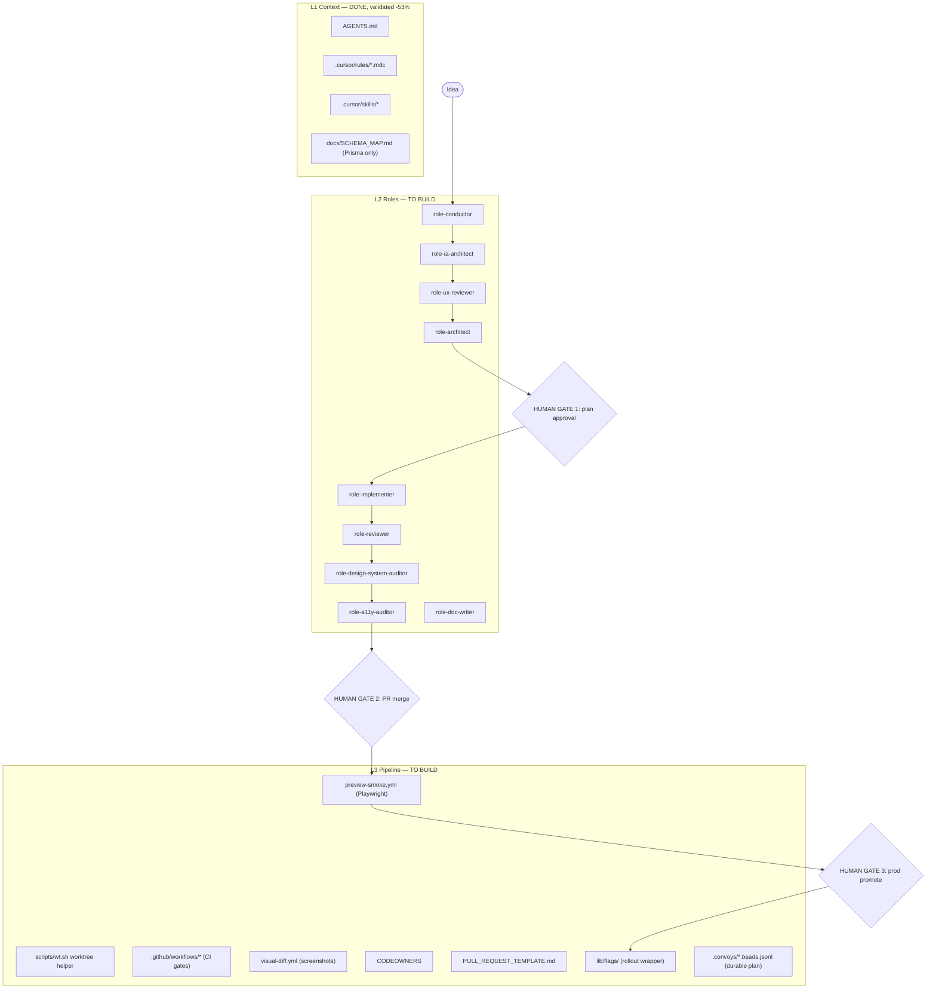

# Orchestration Spec — L2 (subagent roles) + L3 (pipeline)

_Drafted: 2026-05-06. Author: agent + human review._
_Status: **APPROVED + IMPLEMENTED 2026-05-06**. Templates live at `~/.cursor/skills/bootstrap-agent-context/templates/{L1-context,L2-roles,L3-pipeline}/`. SKILL.md drives the deploy. Next: real-repo test on CashflowCopilot, then phased fleet rollout._

This spec defines the next two layers on top of the validated L1 (curated context: AGENTS.md + rules + skills + schema map). L1 hit a -53% conversation-token win on the colab seed task and is being deployed across the fleet via the [`bootstrap-agent-context`](file:///Users/rstillw/.cursor/skills/bootstrap-agent-context/SKILL.md) skill. This spec extends that bootstrap to also drop in **L2 subagent role configs** and **L3 pipeline scaffolding**, so the same one-prompt deploy turns _any_ repo into a full idea-to-feature pipeline.

Lock this spec before writing code. Any change after lock = follow-up PR, not silent edit.

## 1. Goals & non-goals

**Goals:**

1. Take an idea (one-paragraph problem + success metric) and produce a feature-complete, reviewed, deployed change with as little human keystroke as possible _while keeping three meaningful human gates_.
2. Cover the audit categories from the TavernLight plan up-front, not as afterthoughts: IA, UX, design system, componentization, a11y, security, performance, docs, changelog.
3. Same shape across all repos — so the cost of switching between repos is near zero, and so reviewers never wonder "where's the test plan in this repo?"
4. Always-on by default, with explicit `pipeline: skip <gate>` headers controlled by the Conductor subagent (humans don't manually disable gates).
5. Borrow proven concepts from Gas Town (durable workflows, Rule of Five) without adopting Gas Town's CLI/tmux substrate.

**Non-goals:**

1. Replacing GitHub Issues / PRs. We extend, not replace.
2. Auto-opening PRs from subagents. Subagents _propose_; humans hit the button (revisit only at 5+ parallel polecats / overnight swarm scale).
3. Multi-language support. Fleet is 100% TypeScript-on-Node; no Python/Rust/Go templates needed yet.
4. Replacing Cursor's native session/subagent management with custom daemons. Cursor IS the substrate.
5. A "gas town" — no auto-resume daemons, no merge-queue agent, no tmux UI. Manual resume is fine at our scale.

## 2. System overview



| Layer           | State                                               | Lives in repo?                                  | Templated by                                                                                                | Deployed via                    |
| --------------- | --------------------------------------------------- | ----------------------------------------------- | ----------------------------------------------------------------------------------------------------------- | ------------------------------- |
| **L1 Context**  | ✅ Done in colab + survey-platform; templates exist | Yes (committed)                                 | `~/.cursor/skills/bootstrap-agent-context/templates/L1-context/`                                            | The bootstrap skill             |
| **L2 Roles**    | ❌ To build                                         | Yes (`.cursor/agents/*.md` per Cursor 2.4 spec) | `~/.cursor/skills/bootstrap-agent-context/templates/L2-roles/` (NEW)                                        | Bootstrap skill, opt-in flag    |
| **L3 Pipeline** | ❌ To build                                         | Yes, varies per stack                           | `~/.cursor/skills/bootstrap-agent-context/templates/L3-pipeline/{nextjs-prisma,nextjs,node-generic}/` (NEW) | Bootstrap skill, stack-detected |

## 3. L2 — Eight subagent roles

Cursor 2.4+ supports `.cursor/agents/<name>.md` files with YAML frontmatter as project-scoped subagents. Each role below is one such file. Format:

```yaml
---
name: role-<kebab>
description: <when to invoke, in third person>
tools: [Read, Grep, Glob, ...] # Restrict toolset where helpful
model: composer-2-fast | gpt-5.3-codex # Optional, default = parent
---
# Role: <Name>

## Trigger
## Inputs
## Outputs (structured)
## Steps
## Hand-off
```

The eight roles, in pipeline order:

| #   | Role                           | When invoked                                                                              | Primary input                                       | Primary output                                                                                | Tools restriction                               |
| --- | ------------------------------ | ----------------------------------------------------------------------------------------- | --------------------------------------------------- | --------------------------------------------------------------------------------------------- | ----------------------------------------------- |
| 1   | **role-conductor**             | Top of every convoy. Routes idea → other roles, owns skip semantics, owns the convoy file | One-paragraph idea + success metric                 | Convoy file `.convoys/<slug>.md` with todos and gate flags                                    | All read tools + Write to `.convoys/` only      |
| 2   | **role-ia-architect**          | Stage 1: discovery / IA                                                                   | Idea + repo IA (sitemap, route map)                 | User flow sketch (mermaid), screen inventory, content/data model deltas                       | Read-only                                       |
| 3   | **role-ux-reviewer**           | Stage 2: UX/IX review                                                                     | IA output + screen inventory                        | A11y constraints, interaction patterns to reuse, anti-patterns to avoid                       | Read-only                                       |
| 4   | **role-architect**             | Stage 3: technical plan                                                                   | IA + UX outputs + repo conventions                  | File-level plan, API surface, schema diff, test plan, decomposition into N implementer briefs | Read + Glob + Grep                              |
| 5   | **role-implementer**           | Stage 6: build (parallel, N×)                                                             | One implementer brief from the architect            | One PR worth of code, scoped to the brief                                                     | All edit tools, scoped to the brief's file list |
| 6   | **role-reviewer**              | Stage 8: per-PR self-review (post-implementer, pre-human)                                 | Diff + architect's brief                            | Structured PR comment: scope match, conventions, security, regression risk, test coverage     | Read-only                                       |
| 7   | **role-design-system-auditor** | Stage 12: per-PR design audit                                                             | Diff + design tokens + existing component inventory | Hardcoded color/spacing list, missing variant flags, duplicate-component candidates           | Read-only                                       |
| 8   | **role-a11y-auditor**          | Stage 11: per-PR a11y audit                                                               | Preview deploy URL or rendered diff                 | axe-core report + Cursor's native a11y heuristics                                             | Read-only + browser MCP for preview             |
| 9   | **role-doc-writer**            | Stage 17: docs after merge                                                                | Diff + existing AGENTS.md / README / CHANGELOG      | PR with AGENTS.md / README / CHANGELOG / help-content updates                                 | Read + Write to docs only                       |

(Nine, not eight — the IA / UX / Architect chain wants three distinct passes.)

**Always-restricted Conductor**: only Conductor can write to `.convoys/` and only Conductor can set `pipeline: skip` flags. This prevents implementers from accidentally widening their own scope.

## 4. L3 — Pipeline stages, gates, skip semantics

The full idea-to-feature pipeline. Each row is a stage. **Owner** column is the role (L2) or system (L3) that runs it. **Skip-flag** column lists the `pipeline: skip <flag>` value the Conductor can set to bypass that stage.

| #   | Stage                     | Owner                               | Output                                             | Gate?      | Skip flag                        |
| --- | ------------------------- | ----------------------------------- | -------------------------------------------------- | ---------- | -------------------------------- |
| 0   | Idea intake               | Human or `role-conductor`           | One-paragraph problem + success metric             | —          | `intake` (only for hotfix)       |
| 1   | IA / discovery            | `role-ia-architect`                 | Mermaid flow + screen inventory                    | —          | `ia` (docs-only, infra-only)     |
| 2   | UX / IX review            | `role-ux-reviewer`                  | Pattern checklist                                  | —          | `ux` (server-only, no UI change) |
| 3   | Architecture plan         | `role-architect`                    | File plan, API surface, schema diff, decomposition | —          | `arch` (trivial 1-file change)   |
| 4   | Decomposition             | `role-architect` (cont.)            | N implementer briefs                               | —          | (same as `arch`)                 |
| 5   | **Plan approval**         | **Human**                           | Edits + sign-off                                   | **GATE 1** | (never skip)                     |
| 6   | Implementation            | N × `role-implementer` in worktrees | One PR per worker into umbrella branch             | —          | (never skip)                     |
| 7   | Component test            | Vitest + Playwright unit            | Test report on PR                                  | —          | `test` (docs-only)               |
| 8   | Self-review               | `role-reviewer` per PR              | Structured PR comment                              | —          | `review` (hotfix only)           |
| 9   | Lint/types/build          | CI (`.github/workflows/ci.yml`)     | Pass/fail                                          | —          | (never skip)                     |
| 10  | Visual diff / screenshots | Playwright on preview               | Annotated screenshots in PR                        | —          | `visual` (server-only)           |
| 11  | A11y audit                | `role-a11y-auditor` against preview | axe-core report comment                            | —          | `a11y` (server-only)             |
| 12  | Design-system audit       | `role-design-system-auditor`        | Token violations + duplicates                      | —          | `design` (server-only)           |
| 13  | **PR merge**              | **Human**                           | Reviews roll-up, merges to umbrella                | **GATE 2** | (never skip)                     |
| 14  | Umbrella → `develop`      | Release PR                          | Auto-deploy to staging                             | —          | (never skip)                     |
| 15  | Smoke on staging          | Playwright in CI                    | Pass/fail                                          | —          | `smoke` (config-only)            |
| 16  | Manual QA                 | Human                               | Notes                                              | —          | `qa` (config-only)               |
| 17  | Docs                      | `role-doc-writer`                   | PR updating AGENTS.md / README / CHANGELOG         | —          | `docs` (already-documented)      |
| 18  | **Promote to prod**       | **Human**                           | Release PR `develop` → `main`                      | **GATE 3** | (never skip)                     |
| 19  | Flag rollout              | `lib/flags/` + `flag-rollout` skill | 5%→25%→50%→100% with metric checks                 | —          | `flag` (no flag for this change) |
| 20  | Cleanup                   | Auto-task when flag = 100% for 14d  | Remove flag conditional                            | —          | (auto)                           |

**Skip-flag mechanics:**

- Conductor sets skip flags at intake based on the convoy's classification (feature / hotfix / docs-only / infra-only / server-only / config-only).
- Skip flags appear in the convoy file frontmatter AND in the PR description as `<!-- pipeline: skip a11y, design-system -->`.
- CI reads the PR description; if the skip flag is present, the gate's job no-ops (logs the skip + reason).
- Humans cannot edit skip flags after Conductor sets them. To change, re-run Conductor with the new classification.
- Three skip flags can never be set: `plan-approval`, `pr-merge`, `prod-promote`. Human gates are non-negotiable.

**Roll-up reviewer comment**: every auditor (reviewer, design-system, a11y) outputs structured Markdown that gets concatenated into a single "PR Health" comment by a small CI job (or by `role-reviewer` if CI isn't set up). Reviewers see one comment, not five. Format:

```markdown
## PR Health · <date>

| Check         | Status             | Details                           |
| ------------- | ------------------ | --------------------------------- |
| Scope match   | ✅                 | Matches architect brief           |
| Conventions   | ✅                 | requireAuth used, badRequest used |
| A11y          | ⚠️ 2 issues        | Missing label on ...              |
| Design system | ✅                 | All tokens used                   |
| Tests         | ✅                 | 4 added, 0 missing                |
| Visual diff   | 📸 [3 screenshots] |                                   |
```

## 5. Stack-variant inventory

Three L3 variants covering 100% of the in-scope fleet (12 repos):

### Variant A — Next.js + Prisma (4 repos: colab, survey-platform, zest, pickem copy)

L1 templates (existing) + L2 (all 9 roles) + L3:

| File                                     | Purpose                                                  |
| ---------------------------------------- | -------------------------------------------------------- |
| `.github/workflows/ci.yml`               | lint + typecheck + vitest + build                        |
| `.github/workflows/preview-smoke.yml`    | Playwright smoke against staging URL after deploy        |
| `.github/workflows/visual-diff.yml`      | Screenshots on PR open vs main                           |
| `.github/workflows/pr-health-rollup.yml` | Concat auditor comments into one PR comment              |
| `.github/CODEOWNERS`                     | Owner for `prisma/`, `app/api/admin/`, `lib/auth/`, etc. |
| `.github/PULL_REQUEST_TEMPLATE.md`       | Pipeline gates checklist + skip-flag header              |
| `scripts/wt.sh`                          | Worktree helper (create, list, cleanup)                  |
| `scripts/generate-schema-map.ts`         | (already in L1)                                          |
| `lib/flags/`                             | Vercel Edge Config / Cloud Run env-flag wrapper          |
| `.convoys/README.md`                     | Convoy file format spec                                  |
| `tests/playwright/smoke.spec.ts`         | One smoke test stub per repo                             |

### Variant B — Next.js (no Prisma) (4 repos: tavernlight, echo-board, tcg-vault, starfish-ui)

Variant A minus `scripts/generate-schema-map.ts` and the Prisma-related rule. Same CI workflows. Same L2 roles minus the schema-map references in `role-architect`.

### Variant C — Node generic (3 repos: FamilyCalendar, tasks, tales-n-tails)

Reduced surface: no Playwright preview-smoke, no visual-diff (likely no UI), but same Conductor + Architect + Implementer + Reviewer + Doc-writer roles.

| File                               | Purpose                               |
| ---------------------------------- | ------------------------------------- |
| `.github/workflows/ci.yml`         | lint + vitest                         |
| `.github/CODEOWNERS`               | (optional, only if multi-contributor) |
| `.github/PULL_REQUEST_TEMPLATE.md` | Reduced pipeline checklist            |
| `.convoys/README.md`               | Convoy file format spec               |

Skipped roles for variant C: `role-ia-architect`, `role-ux-reviewer`, `role-design-system-auditor`, `role-a11y-auditor` (no UI to audit).

### Variant edge cases

- **BASH (Vite SPA)**: starts as Variant B, drop Next.js-specific bits.
- **CashflowCopilot (greenfield)**: no stack yet; bootstrap creates a barebones AGENTS.md + Conductor-only L2 + minimal L3, expand as the stack lands.
- **tales-art-pipeline-template**: this IS a template repo; bootstrap should skip and ask the human.

## 6. Bootstrap-skill extension plan

Today the [`bootstrap-agent-context`](file:///Users/rstillw/.cursor/skills/bootstrap-agent-context/SKILL.md) skill produces L1 only. Extension:

```
~/.cursor/skills/bootstrap-agent-context/
├── SKILL.md                                       (extend: add L2/L3 sections)
└── templates/
    ├── L1-context/                                (existing — move existing templates into this subfolder)
    │   ├── AGENTS.md.template
    │   ├── no-go-zones.mdc
    │   ├── api-routes.mdc.template
    │   ├── prisma.mdc.template
    │   ├── prisma-schema-map.mdc.template
    │   ├── generate-schema-map.ts
    │   ├── agent-context-readme.md.template
    │   └── validation.md.template
    ├── L2-roles/                                  (NEW — 9 role configs, stack-agnostic)
    │   ├── role-conductor.md
    │   ├── role-ia-architect.md
    │   ├── role-ux-reviewer.md
    │   ├── role-architect.md
    │   ├── role-implementer.md
    │   ├── role-reviewer.md
    │   ├── role-design-system-auditor.md
    │   ├── role-a11y-auditor.md
    │   └── role-doc-writer.md
    └── L3-pipeline/                               (NEW — stack-variant subfolders)
        ├── _common/                               (shared across variants)
        │   ├── PULL_REQUEST_TEMPLATE.md.template
        │   ├── convoys-readme.md.template
        │   └── wt.sh
        ├── nextjs-prisma/
        │   ├── ci.yml
        │   ├── preview-smoke.yml
        │   ├── visual-diff.yml
        │   ├── pr-health-rollup.yml
        │   ├── CODEOWNERS.template
        │   ├── flags-vercel-edge-config.ts.template
        │   └── playwright-smoke.spec.ts.template
        ├── nextjs/
        │   └── (same as nextjs-prisma minus prisma references)
        └── node-generic/
            ├── ci.yml
            ├── CODEOWNERS.template
            └── PULL_REQUEST_TEMPLATE.md (reduced)
```

**SKILL.md additions**:

- New stack-detection rules: detect existing CI workflows, existing PR template, existing CODEOWNERS — never overwrite.
- New `AskQuestion` step after L1 detection: _"Bootstrap which layers? L1 (recommended for all), L2 (recommended for repos with active feature work), L3 (recommended for repos with deploy pipeline)."_
- Per-stack L3 file selection driven by detected variant (A/B/C).
- Each layer is independent — can add L2 later without re-doing L1, can add L3 later without re-doing L2.
- Hand-off includes a per-layer review checklist.

## 7. Idea → feature lifecycle (worked example)

To make it concrete, here's how an idea moves through the pipeline. Take a real feature: _"Add bookmark count badge to post cards on the home feed."_

| Step  | Who                       | What happens                                                                                                                                                   | Time                   |
| ----- | ------------------------- | -------------------------------------------------------------------------------------------------------------------------------------------------------------- | ---------------------- |
| 0     | Human prompt              | _"Add bookmark count badge to post cards on home feed; success = visible count, no perf regression"_                                                           | 30s                    |
| 1     | role-conductor            | Classifies: feature, UI-touching, no schema change. Sets skip flags: none. Creates `.convoys/bookmark-count-badge.md` with todos.                              | 30s                    |
| 2     | role-ia-architect         | No new pages or routes; identifies that PostCard component is the only touchpoint. Confirms with a one-line IA check.                                          | 30s                    |
| 3     | role-ux-reviewer          | Notes: should match existing reaction count style; should be hidden when count = 0; should not increase card height.                                           | 1 min                  |
| 4     | role-architect            | Schema: no change (Bookmark already exists). API: new `select.{ _count }` in posts query. UI: PostCard.tsx + a unit test. Decomposes into 1 implementer brief. | 1 min                  |
| 5     | **Human gate 1**          | Reviews plan: 1 PR, 30 LOC. Approves.                                                                                                                          | 1 min                  |
| 6     | role-implementer          | Opens PR. Adds `_count.bookmarks` to posts query, renders badge in PostCard, adds Vitest.                                                                      | 3 min                  |
| 7-8   | CI + role-reviewer        | Lint passes. Reviewer notes: "Scope matches; missing aria-label on badge for screen readers." Implementer fixes.                                               | 2 min                  |
| 10-12 | Auditors                  | Visual diff: 3 screenshots attached. A11y: 0 issues post-fix. Design system: ✅ (uses existing badge primitive).                                               | 2 min                  |
| 13    | **Human gate 2**          | Reviews PR Health roll-up. Merges to umbrella.                                                                                                                 | 30s                    |
| 14-15 | Umbrella → develop, smoke | Auto-deploys to staging. Smoke spec passes.                                                                                                                    | 5 min (mostly waiting) |
| 17    | role-doc-writer           | CHANGELOG entry under `[Unreleased]`. AGENTS.md unchanged (no convention shift).                                                                               | 1 min                  |
| 18    | **Human gate 3**          | Release PR `develop` → `main`. Auto-deploy to prod.                                                                                                            | 30s                    |
| 19    | Flag rollout              | None — small UI change, no flag needed. Conductor set `pipeline: skip flag` at intake.                                                                         | 0                      |

**Total human time: ~3 minutes.** Total wall time: ~20 minutes (mostly CI). Total agent tokens: estimated 30-50K across all roles (vs. ~80K for the same change in colab today using just L1).

## 8. Rollout & validation

Implementation in three batches, each ~1 sitting:

| Batch                                 | Scope                                                                                                                                                | Validates                                                                          | Acceptance                                                                                                    |
| ------------------------------------- | ---------------------------------------------------------------------------------------------------------------------------------------------------- | ---------------------------------------------------------------------------------- | ------------------------------------------------------------------------------------------------------------- |
| **A. Build templates + extend skill** | Create L2-roles/ + L3-pipeline/ in `~/.cursor/skills/bootstrap-agent-context/templates/`. Update SKILL.md. Smoke-test by reading end-to-end.         | Skill structurally complete                                                        | All template files present, SKILL.md activates on the right keywords, no syntax errors                        |
| **B. Test on CashflowCopilot**        | Run extended bootstrap against the greenfield repo.                                                                                                  | First real run outside colab. Catches mismatches between templates and real repos. | Bootstrap produces sensible drafts that need <30 min of human polish; no overwrites of files that don't exist |
| **C. Roll out to fleet**              | Three sub-batches per the earlier inventory. After each repo: 1 measurement run (idea-to-feature on something small) and decision to keep / iterate. | Templates generalize across the 3 stack variants                                   | ≥50% conversation-token reduction on a representative seed task per repo (same bar as L1)                     |

**Validation seed task per stack variant** (so we don't re-pick a task for every repo):

- Variant A (Next.js + Prisma): _"Add a POST /api/<resource>/[id]/<action> route with Zod validation, requireAuth, and a Vitest test"_ — same shape as the colab seed.
- Variant B (Next.js): _"Add a new page at /<route> that renders <component> and has a basic Playwright smoke test"_.
- Variant C (Node): _"Add a new module exposing <function> with input validation and a Vitest test"_.

## 9. Open questions (non-blocking; defer if unanswered)

1. **Convoy file format**: Markdown with YAML frontmatter (current) vs. structured JSONL (Beads-inspired). Recommendation: stay Markdown for human readability; add a JSONL "compiled view" later if the agent's parsing of Markdown is unreliable.
2. **Worktrees**: do we want them? colab's existing convoy work hasn't needed them. Cursor's parallel chats handle most of what worktrees would. Recommendation: ship `scripts/wt.sh` as part of L3 but mark as opt-in; default to "spawn parallel Cursor chats" for now.
3. **Browser-MCP for a11y audits**: requires the user to enable a browser MCP (`cursor-ide-browser`). Alternative: use Playwright + axe-core in CI without involving an MCP. Recommendation: Playwright path. Less moving parts, runs the same way for everyone.
4. **Visual diff storage**: PR comments only, or also commit baselines to a `.visual-baselines/` dir? Recommendation: comments only at first; add baselines if we hit too many false positives.
5. **Flag wrapper**: which provider? Vercel Edge Config (works for the repos that deploy to Vercel) vs. a generic env-based flag (works everywhere including Cloud Run). Recommendation: ship a generic env-based wrapper as the default; document Vercel Edge Config as an opt-in for Vercel repos.
6. **`tales-art-pipeline-template`**: skip in bootstrap (it's a template repo itself, bootstrapping it is meaningless).

## 10. Out of scope (deferred — explicit list to prevent scope creep)

- Multi-language template variants (Python, Rust, Go) — fleet doesn't need them.
- Auto-opening PRs from subagents — defer until 5+ parallel polecat workload.
- Federation across multiple developer machines — single-developer fleet today.
- Cost ceilings / per-role model tier configs — defer until token cost becomes a real constraint.
- Plugin / molecule marketplace ("Mol Mall") — out of scope at this scale.
- Real-time agent dashboards / TUIs — Cursor IS the dashboard.
- Auto-resume on session restart (Gas Town's GUPP) — manual resume is fine; revisit if context blowouts become frequent.
- Replacing GitHub Issues with Beads-style JSONL.

## 11. Acceptance criteria for this spec

Before exiting Ask mode and writing code, this spec should:

- [ ] Be readable end-to-end by a human in <10 min
- [ ] Define every L2 role's trigger / inputs / outputs
- [ ] Define every L3 stage with a skip-flag and a gate marker
- [ ] List every template file by name and per-stack variant
- [ ] Have a "what to build first" answer (= Batch A in §8)
- [ ] Have a worked example (= §7)
- [ ] Have an explicit out-of-scope list (= §10)
- [ ] Be acknowledged or edited by the human reviewer (= you)

If any of those are weak, edit before we start building.
