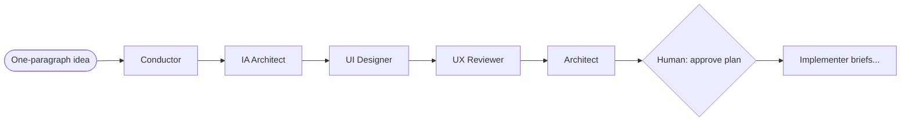
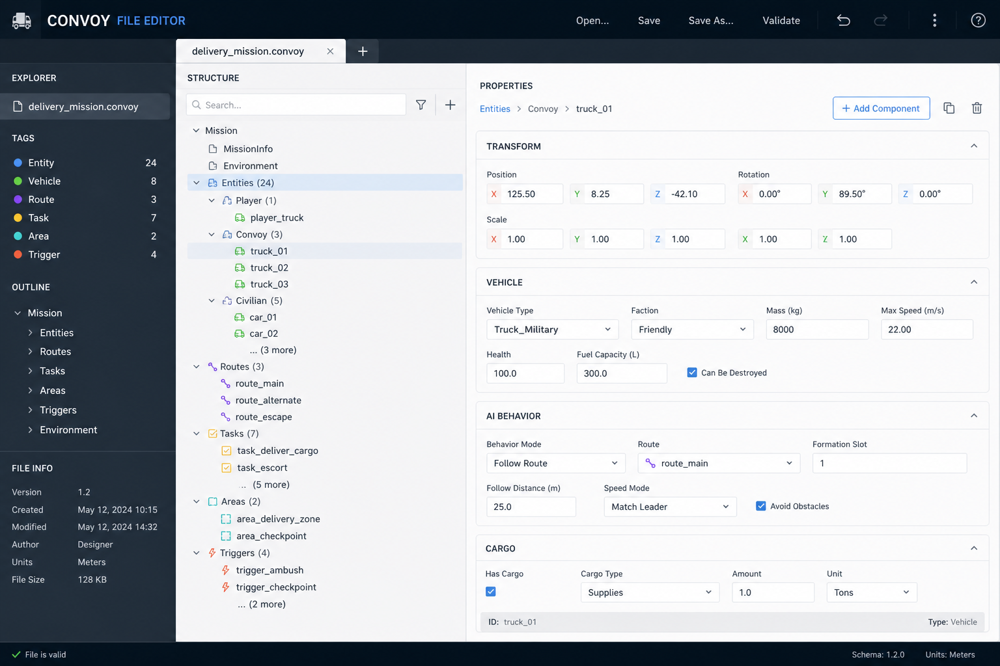
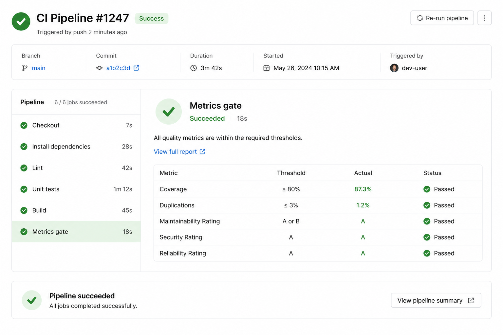

# Walkthrough 1 — Start a convoy

This walkthrough shows the **first half** of a real feature convoy: from a one-paragraph idea through planning roles until the **human plan-approval gate**. It uses the `debt-payoff` convoy from [zest](https://github.com/varutasu/zest-finances) (private) as the worked example.

**Time:** ~15 minutes of agent work + ~2 minutes of your review at the gate.

**Prerequisites:**

- Repo bootstrapped with L1 + L2 (at minimum: `AGENTS.md`, `.cursor/agents/role-*.md`, `.convoys/README.md`)
- L3 recommended: `scripts/log-convoy-event.sh` + `convoy-metrics-gate.yml` (see end of this doc)

---

## What you're building

A convoy is **one durable plan file** plus optional brief sub-files. The agent pipeline reads and updates that file as roles run — you don't re-explain context each time.



---

## Step 1 — Kick off with the Conductor

Open Cursor in your repo and prompt:

> *"Start a new convoy: Add a debt payoff planner so users can compare snowball vs avalanche strategies and see a debt-free date. Success = users with multiple debts can model extra payments and see total interest saved."*

Or invoke the role explicitly:

> *"Run role-conductor: …"*

The Conductor **does not write code**. It writes exactly one file: `.convoys/<slug>.md`.

### What the convoy file looks like



Real excerpt from zest's `debt-payoff` convoy:

```yaml
---
name: debt-payoff
classification: feature
success_metric: Users with multiple debts can pick a payoff strategy...
skip: []
status: open
created: 2026-07-30
model_policy:
  default_session: auto
  roles:
    role-conductor: claude-4.6-opus-high-thinking
    role-architect: claude-4.6-opus-high-thinking
    role-ia-architect: composer-2.5-fast
    ...
---
```

Body sections the Conductor creates:

1. `## Why` — user impact
2. `## Scope` — in / out
3. `## Roles invoked` — ordered list for this classification
4. `## Todos` — checkboxes the next roles refine

The Conductor prints a one-line hand-off:

> *Convoy `debt-payoff` created (classification: `feature`, skipping: none). Next role: role-ia-architect.*

**You** run the next role — the pipeline keeps humans at the steering wheel for early direction.

---

## Step 2 — Planning roles (serial)

For a `feature` classification, run these in order. Each role **appends** to the convoy file (or adds a `## Design direction` section).

| Order | Role | Prompt | Adds to convoy |
| --- | --- | --- | --- |
| 1 | `role-ia-architect` | *"Run role-ia-architect on convoy debt-payoff"* | `## IA` — routes, screens, data touchpoints |
| 2 | `role-ui-designer` | *(only if new UI + `ui-ux-pro-max` skill installed)* | `## Design direction` in frontmatter + body |
| 3 | `role-ux-reviewer` | *"Run role-ux-reviewer on convoy debt-payoff"* | `## UX` — patterns, anti-patterns |
| 4 | `role-architect` | *"Run role-architect on convoy debt-payoff"* | `## Architecture` + `.convoys/debt-payoff/brief-*.md` |

Invoke roles from the **Agents** dropdown so each role's `model:` frontmatter applies (fast models for IA/UX; Opus for architect on hard features).

### After the Architect

The architect decomposes work into **implementer briefs** — one PR-sized slice per file:

```
.convoys/debt-payoff/
├── brief-1-schema-and-payoff-engine.md
├── brief-2-debt-plan-api.md
├── brief-3-planner-components.md
...
```

Each brief lists explicit `files:` and `depends_on:` so you know what can run in parallel later.

---

## Step 3 — Human gate 1 (plan approval)

**Stop here.** Read:

- `.convoys/<slug>.md` — full plan
- `.convoys/<slug>/brief-*.md` — scope per PR

Approve, edit, or send back. Update convoy frontmatter:

```yaml
status: in-progress
```

Only after approval do you dispatch `role-implementer` (Walkthrough 2 covers implementation + audit fan-out).

---

## Step 4 — Log metrics (every role)

After each role completes, it should run:

```bash
bash scripts/log-convoy-event.sh \
  role=role-architect \
  convoy=debt-payoff \
  classification=feature \
  duration_s=300 \
  model=claude-4.6-opus-high-thinking \
  model_tier=premium
```

That appends one JSON line to `.convoys/.metrics.jsonl`:

```json
{"ts":"2026-07-31T12:13:58Z","role":"role-architect","convoy":"debt-payoff","repo":"zest","duration_s":300,"model":"claude-4.6-opus-high-thinking","model_tier":"premium"}
```

No code, no prompts — just which role ran, how long, which model.

---

## Step 5 — Convoy PR + metrics gate

When you open a PR for convoy work:

1. **Title** must start with `convoy:` — e.g. `convoy: debt payoff brief 1 — schema and payoff engine`
2. **Include** new rows in `.convoys/.metrics.jsonl` in the same PR
3. CI runs the metrics gate



If the gate fails:

| Error | Fix |
| --- | --- |
| `.metrics.jsonl` missing | Run `log-convoy-event.sh` after each role; commit the file |
| No new `+{` lines in diff | Same — at least one new event row per convoy PR |
| Emergency bypass | Add `skip-metrics` label + document why in PR body (rare) |

Non-convoy PRs skip the gate automatically (title doesn't match `convoy:`).

---

## Fleet analytics

After a few convoys, aggregate across repos:

```bash
cd ~/code/agent-pipeline/analytics
npx tsx analyze-convoys.ts \
  ~/Documents/Personal\ Coding\ Projects/zest \
  ~/Documents/Personal\ Coding\ Projects/tcg-vault
npx tsx render-dashboard.ts
open ~/agent-pipeline-data/dashboard.html
```

You'll see role frequency, skip patterns, and median duration per role — the input for pipeline improvements.

---

## Quick reference — prompts cheat sheet

```text
# Start
"Start a new convoy: <idea>. Success = <metric>."

# Planning chain (feature)
"Run role-ia-architect on convoy <slug>"
"Run role-ui-designer on convoy <slug>"      # if new UI
"Run role-ux-reviewer on convoy <slug>"
"Run role-architect on convoy <slug>"

# After you approve the plan
"Run role-implementer on convoy <slug> brief 1"

# Hotfix shortcut (skips IA/UX/arch)
"Start a new convoy: fix auth bypass on admin route. Success = unauthenticated users cannot access admin APIs."
# Conductor sets classification: hotfix, skip: ia, ux, ui-design, arch
```

---

## Deploying the metrics gate on a new repo

If your repo has L3 but not the gate yet:

1. Copy `.github/workflows/convoy-metrics-gate.yml` from the pipeline template (`skills/bootstrap-agent-context/templates/L3-pipeline/_common/convoy-metrics-gate.yml.template`)
2. Ensure `.convoys/.metrics.jsonl` is **not** in `.gitignore`
3. Commit existing metrics history (if any) so the first convoy PR adds rows on top of a baseline
4. Update `.github/PULL_REQUEST_TEMPLATE.md` to remind: `convoy:` title + metrics rows

**Already deployed:** tcg-vault (self-hosted runners). **Added in this pass:** zest (GitHub-hosted `ubuntu-latest`).

---

## Next

- [Walkthrough index](README.md)
- [Multitask playbook](../multitask-playbook.md) — audit fan-out after implementer
- [role-reference.md](../role-reference.md) — every role's trigger and output
